# ARMA-GARCH_Equity_Market_Volatility_Regime_Analysis

Model and interpret volatility regimes in equity markets by separating return dynamics from volatility dynamics, and assess how risk evolves across market conditions.

## TL;DR

- Builds ARMA‑GARCH volatility regimes on SPX and compares them to VIX.
- Default model selection prioritizes realized‑vol tracking (GARCH), with BIC‑best available via config.
- Regime labels drive a risk‑control overlay that reduces drawdowns at the cost of lower return.
- Hedge‑cost monitoring flags when protection is cheap vs expensive.
- Backtest: regime strategy lowers drawdowns; see [reports/strategy_backtest/README.md](https://github.com/Terraform05/ARMA-GARCH_EquityMarketVolatilityRegimeAnalysis/blob/main/reports/strategy_backtest/README.md).

## Abstract - 1-year Backtest

This report summarizes a last-year out of sample run that trains on the prior year and evaluates the 2025-01-21 to 2026-01-21 window. The April 2025 tariff shock and subsequent policy reversals and fast headline shifts dominate the volatility regime, driving a sharp spike in conditional variance, a high-vol regime cluster, and a clear separation between implied and realized volatility. Rolling forecasts track the shock faster than static forecasts, while regime-based exposure cuts reduce drawdown depth at the cost of lower total return versus buy-and-hold. Event chronologies tie each key plot to the policy and macro catalysts that shaped the risk environment.

Full report: [runs/oos/aram_last_year/2025-01-21_to_2026-01-21/20260121_111845/README.md](https://github.com/Terraform05/ARMA-GARCH_EquityMarketVolatilityRegimeAnalysis/blob/main/runs/oos/aram_last_year/2025-01-21_to_2026-01-21/20260121_111845/README.md)
Comparison report (train 1y vs 5y): [runs/oos/aram_last_year/2025-01-21_to_2026-01-21/README_compare_train_1y_vs_5y.md](https://github.com/Terraform05/ARMA-GARCH_EquityMarketVolatilityRegimeAnalysis/blob/main/runs/oos/aram_last_year/2025-01-21_to_2026-01-21/README_compare_train_1y_vs_5y.md)

## Project Objective (Economic Lens)

This project focuses on regime interpretation, not trading or alpha generation. It aims to explain *market behavior* (stability vs transition) by identifying volatility regimes and showing how regime conviction (or lack thereof) drives realized volatility and risk repricing. The core questions and answers are:

- **When is the market calm vs stressed?** Conditional volatility regimes split at low <= 0.007292 and high >= 0.009889, with mid‑regime as transitional.
- **How persistent are volatility shocks?** GARCH persistence is high (alpha + beta ≈ 0.980), so volatility shocks decay slowly.
- **How does implied volatility (VIX) compare to realized volatility?** VIX aligns best with 10‑day realized volatility in this sample; divergence periods indicate risk pricing mismatches.
- **What does this mean for risk and valuation confidence?** High‑vol regimes coincide with higher VIX and deeper drawdowns, implying lower valuation confidence and higher hedge costs.

## Conceptual Framework: What Is a Market Regime?

A market regime is a statistically persistent state of market behavior characterized by distinct volatility dynamics. Regimes are descriptive, not predictive: they summarize how markets behave over time rather than forecast specific price moves.

Key distinctions:
- Regimes describe risk environments, not direction.
- Regimes persist but can transition abruptly.
- Volatility is regime‑dependent, not constant.
- Regimes are not predictions; they are statistical states of behavior.
- Volatility clustering means large moves tend to be followed by large moves (and small by small), which is why regimes persist.

## Data & Scope

- Assets: S&P 500 Index (^GSPC), VIX Index (^VIX)
- Frequency: Daily (EOD)
- Sample period: 2010‑01‑01 to 2026‑01‑01
- Transformations: log returns and squared returns
- Output: aligned dataset for return modeling and volatility estimation

## Methodology Overview

The analysis follows a structured pipeline designed to isolate volatility behavior:

1) **Return modeling (ARMA)**  
   ARMA removes short‑run autocorrelation in returns and isolates the unpredictable component.

2) **Volatility modeling (GARCH)**  
   GARCH estimates conditional variance and captures volatility clustering and persistence.

3) **Regime identification**  
   Volatility dynamics are segmented into regimes based on conditional variance behavior.

4) **Regime exposure measurement**  
   A regime strip quantifies the strength of market exposure to each volatility regime at a given point in time.

Schematic (conceptual flow):

`returns → ARMA → residuals → GARCH volatility → regimes/exposure → volatility behavior vs VIX`

## Why ARMA + GARCH?

ARMA and GARCH are selected because they target two distinct properties of financial returns and keep “signal” separate from “risk”:

**ARMA (mean):** removes short‑run predictable structure in returns (small autocorrelation, microstructure effects, brief mean reversion). This yields *true shocks*—the part of returns not explained by the past.

- **To measure unexpected moves (risk), we first remove expected moves using ARMA.**

**GARCH (variance):** models time‑varying volatility and persistence using those shocks, so volatility responds to *unexpected* news rather than predictable patterns.

- **To understand how risk evolves over time, we model how the size of unexpected moves clusters and persists using GARCH.**

If ARMA is skipped, predictable structure can leak into the volatility model and inflate risk estimates. Together, ARMA + GARCH isolate regime‑driven variance behavior so regime analysis focuses on volatility rather than price direction.

## Interpreting Regime Exposure (Core Insight)

Regime labels alone are insufficient. The key variable is regime exposure — the degree to which market behavior is concentrated in a single regime versus dispersed across multiple regimes.

High regime exposure:
- Strong market consensus
- Capital anchored to a dominant volatility regime
- Stable risk pricing
- Typically associated with lower realized volatility

Low regime exposure:
- Weak regime conviction
- Uncertainty about the prevailing risk environment
- Continuous repricing of risk
- Typically associated with higher realized volatility, especially during transitions

Why transitions matter more than steady states:
- Transitions are where exposure is weakest and volatility spikes.
- Stable regimes show compressed volatility and slower repricing.

## Volatility as an Outcome of Uncertainty

Volatility is not random noise in this framework. It is the observable outcome of uncertainty about regime persistence.

- Low volatility reflects confidence and consensus.
- High volatility reflects disagreement and uncertainty.
- Volatility clusters when regime conviction breaks down.

## Relationship Between Model‑Based Volatility and VIX

Model‑implied volatility and VIX play complementary roles:

- GARCH volatility reflects realized and conditional variance.
- VIX reflects market‑implied expectations of future volatility.

Divergences often occur during regime transitions, when expectations adjust faster than realized outcomes (or vice versa). In practice, VIX can lead when markets reprice risk ahead of realized moves, while GARCH can lead when realized variance rises before options reprice. These gaps are informative about risk pricing and hedging costs.

## Transitional vs Stable Market States

Volatility behavior differs sharply between stable and transitional market states:

- **Stable regimes:** high exposure, predictable risk pricing, volatility compression
- **Transitional regimes:** low exposure, rapid repricing, volatility spikes

Volatility is highest during transitions, not within stable regimes themselves.

## Practical Applications

This framework can be used for:

- Risk management and stress testing
- Volatility targeting and leverage control
- Identifying volatility selling vs buying environments
- Detecting early signs of regime instability

## Limitations

- Regimes are backward‑looking.
- GARCH captures conditional variance, not tail risk.
- Structural breaks can disrupt regime persistence.
- Regime identification depends on model assumptions.
- What breaks the model: sudden policy shifts, market microstructure changes, and regime durations that are too short for the chosen window can invalidate the regime signal.

## Key Takeaway

Volatility is lowest when markets are confident in their regime and highest when regime conviction breaks down.

This project reframes volatility as a signal of market uncertainty and regime transition, rather than random fluctuation.

## Quick Start

    python3 -m venv .venv
    source .venv/bin/activate
    pip install -r requirements.txt
    python scripts/run_all.py

## Optimization Workflow (Regime-Trend Strategy)

1) Run the walk-forward sweep and freeze the best config (Sortino, net of costs):

    python scripts/run_regime_trend_optimize.py

   This writes `configs/regime_trend_best.json`.

2) Run the pipeline using the frozen config:

    python scripts/run_all.py

   If the frozen config exists, the regime-trend backtest uses it automatically.

## Repository Layout

- `configs/`: run configs and experiment settings.
- `configs/active/`: snapshot of the config used by the most recent full run.
- `data/`: raw/processed/interim datasets.
- `docs/`: pipeline notes in `docs/pipeline/`, readable summaries in `docs/readmes/`.
- `reports/`: curated outputs and plots.
- `runs/`: timestamped, self-contained execution outputs (e.g., `runs/oos/`).
- `scripts/`: thin CLI wrappers that call `src/`.
- `src/`: reusable modeling/analysis modules.
- `src/signals/`: signal components used by strategies.
- `src/strategies/`: strategy implementations and sizing logic.
- `strategy/`: strategy documentation and design notes.
- `tests/`: unit/integration tests.
- `tools/`: maintenance and validation helpers.

## Reports vs Runs

- `reports/` contains curated outputs meant for reading and comparison over time.
- `runs/` contains timestamped, self-contained execution outputs for audits and reproducibility.

## Run Registry

`runs/index.csv` tracks each `run_all` execution with timestamps, data end date,
objective, and the frozen config snapshot used (if any).

## Dependencies

- Python 3.10+
- `pip install -r requirements.txt`

## General Overview

This project takes daily S&P 500 prices and the VIX index, transforms them into returns, then models how average returns behave and how volatility changes over time. The model produces a time series of conditional volatility, which is used to label low‑ and high‑volatility regimes and compare to implied volatility (VIX). Diagnostics and validation checks show whether the model is a good fit or whether volatility dynamics remain unexplained.

The workflow is intentionally linear: data prep feeds diagnostics; diagnostics guide model choice; modeling produces conditional volatility; validation checks model adequacy; regime analysis interprets volatility states; the out of sample check stress‑tests the model’s forecasting behavior.

## Math (Explained)

We work with log returns because they are additive over time and behave better statistically than prices. Let $P_t$ be the S&P 500 adjusted close on day $t$. The log return is:

$$
r_t = \log\left(\frac{P_t}{P_{t-1}}\right)
$$

Key variables:
- $r_t$ is the log return on day $t$.
- $P_t$ and $P_{t-1}$ are the adjusted close prices on days $t$ and $t-1$.
- $t$ indexes trading days.

The mean process is modeled with ARMA $(p, q)$, which allows returns to depend on their own past values (AR terms) and on past shocks (MA terms). This captures short‑run autocorrelation:

$$
r_t = \mu + \sum_{i=1}^{p} \phi_i r_{t-i} + \sum_{j=1}^{q} \theta_j \epsilon_{t-j} + \epsilon_t
$$

Key variables:
- $\mu$ is the mean return.
- $\phi_i$ are AR coefficients on past returns $r_{t-i}$.
- $\theta_j$ are MA coefficients on past shocks $\epsilon_{t-j}$.
- $\epsilon_t$ is the return shock (innovation) at time $t$.
- $p$ and $q$ are the AR and MA orders.

ARCH (Autoregressive Conditional Heteroskedasticity) models volatility as a function of past squared shocks; in other words, big moves tend to be followed by bigger variance. GARCH (Generalized ARCH) extends this by also including the previous day’s variance, which captures persistence in volatility over time.

The variance process is modeled with GARCH(1,1), which allows volatility to change over time and respond to recent shocks. The conditional variance $\sigma_t^2$ depends on yesterday’s squared shock and yesterday’s variance:

$$
\sigma_t^2 = \omega + \alpha \epsilon_{t-1}^2 + \beta \sigma_{t-1}^2
$$

Key variables:
- $\sigma_t^2$ is the conditional variance at time $t$.
- $\epsilon_{t-1}$ is yesterday’s return shock.
- $\omega$ is the long‑run variance level.
- $\alpha$ controls how strongly volatility reacts to new shocks.
- $\beta$ controls how persistent volatility is.
- $\alpha + \beta$ near 1 implies slow decay of volatility shocks.

To compare model output with VIX, we compute a rolling realized volatility proxy and annualize it. For window length $w$ (in trading days), the realized volatility is:

$$
\text{RV}_{t,w} = \sqrt{252} \times \text{StdDev}(r_{t-w+1:t}) \times 100
$$

Key variables:
- $\text{RV}_{t,w}$ is realized volatility at time $t$ using window length $w$.
- $w$ is the lookback window in trading days.
- $\text{StdDev}(r_{t-w+1:t})$ is the standard deviation of returns over the window.
- $\sqrt{252}$ annualizes daily volatility; $\times 100$ converts to percent.

The $\sqrt{252}$ factor annualizes daily volatility using the standard number of trading days per year, and the $\times 100$ converts it to percent to match VIX units.

## Steps And How They Fit Together

1) **Data preparation**  
   Download SPX and VIX, align by NYSE trading days, and compute returns. This produces the single aligned dataset used everywhere else. Without this aligned dataset, every downstream step fails or becomes inconsistent.

2) **Preliminary diagnostics**  
   Returns are stationary (ADF statistic -13.7338, p < 0.001) and volatility clustering is strong (ARCH statistic 1270.0264, p < 0.001). This supports ARMA for the mean and GARCH‑family models for the variance.  
The plots below show return clustering and short‑lag dependence.

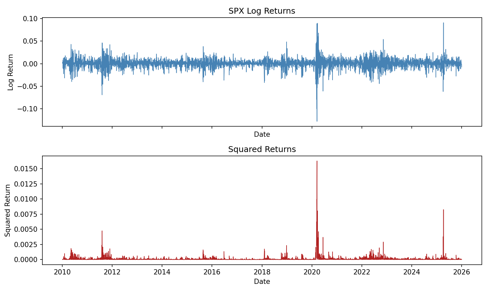
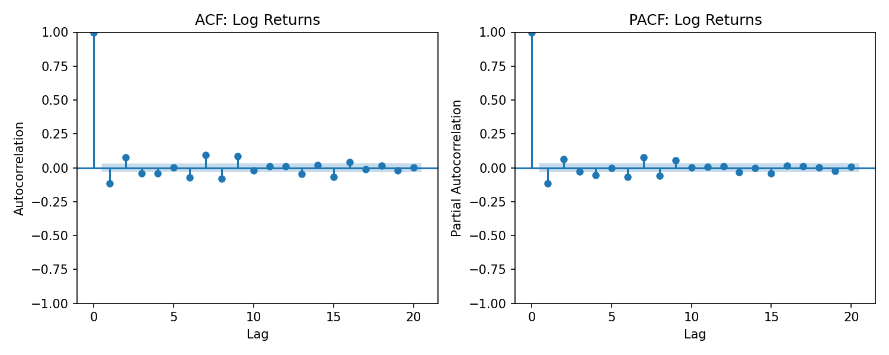

Plot notes:
- Returns and squared returns: squared returns cluster into bursts, showing volatility clustering and motivating GARCH.
- Returns and squared returns: large spikes align with stress windows and highlight tail risk.
- ACF and PACF: return autocorrelation decays quickly, but squared returns persist, indicating volatility dynamics.

3) **Model variants and selection**  
   GARCH, GJR, and EGARCH variants are compared with normal vs Student‑t errors. By default the pipeline selects the best model by realized‑vol tracking (currently **GARCH**), which aligns the model to observed volatility behavior.  
   You can switch selection to BIC by setting `VARIANT_SELECTION = "bic"` in `src/config.py`.
   Use the charts below to see how top variants track realized volatility and how information criteria differ.
   If your goal is interpretability or in‑sample fit, BIC is the right compass; if your goal is volatility tracking (risk monitoring), the realized‑vol metrics are the better guide.

Plot notes:
- Variant comparison: top models co-move in calm periods; stress windows reveal meaningful divergence.
- Variants vs realized: closest tracking line indicates best realized-vol alignment; persistent gaps show scale bias.
- Variant metrics: lower (more negative) AIC/BIC is better, but only relative differences matter.
- Best variant volatility: the conditional vol path should spike during stress and mean-revert after.
- BIC vs tracking: the tradeoff shows whether you are optimizing fit or realized-vol tracking.

Variant accuracy vs realized volatility (lower RMSE/QLIKE and higher correlation are better):

| Variant | Corr | RMSE | QLIKE |
| --- | --- | --- | --- |
| GARCH | 0.9587 | 3.0347 | 6.1994 |
| GARCH_t | 0.9297 | 3.5652 | 6.2014 |
| GJR | 0.8901 | 4.3646 | 6.2286 |
| GJR_t | 0.8901 | 4.3646 | 6.2286 |
| EGARCH_t | 0.8173 | 5.4161 | 6.2747 |
| EGARCH | 0.8081 | 5.5010 | 6.2790 |

QLIKE (quasi‑likelihood) is a volatility‑forecast loss defined as: QLIKE = mean(realized_var / forecast_var + log(forecast_var)). Lower is better and it is robust to noise in realized variance.

Note: EGARCH_t wins on BIC (in‑sample fit), while GARCH has the best realized‑vol tracking metrics. This highlights the tradeoff between model fit and out‑of‑sample alignment.

To force the pipeline to use the BIC‑best model, set `VARIANT_SELECTION = "bic"` in `src/config.py` before running the pipeline.

4) **Modeling (mean + variance)**  
   The selected ARMA order is (2, 0) with BIC -24948.0268. The GARCH variance model yields parameters: omega 0.000002, alpha[1] 0.100000, beta[1] 0.880000 (alpha + beta = 0.980000). This model’s conditional volatility is the core input for regimes and implied vs realized comparisons.

5) **Model validation**  
   Residual autocorrelation remains at lag 20 (Ljung‑Box p = 0.000011), and squared residuals and ARCH tests are still significant (p ≈ 0.0087 and p ≈ 0.0255). This indicates remaining variance structure despite the model fit.  
   Residual plots confirm the remaining structure visually.
   Practical takeaway: the volatility model is adequate for regime labeling, but return predictability is still limited.

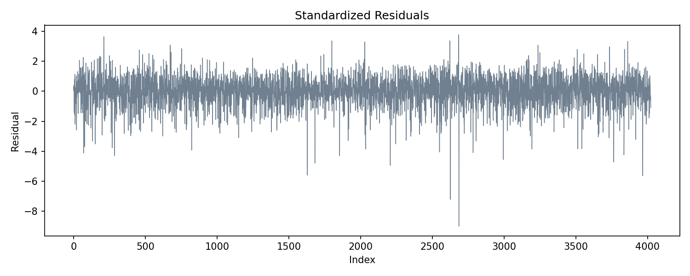
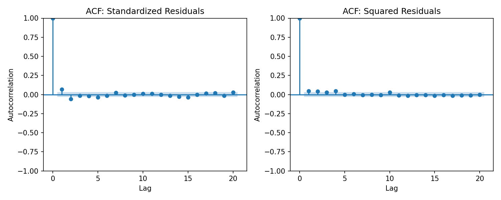
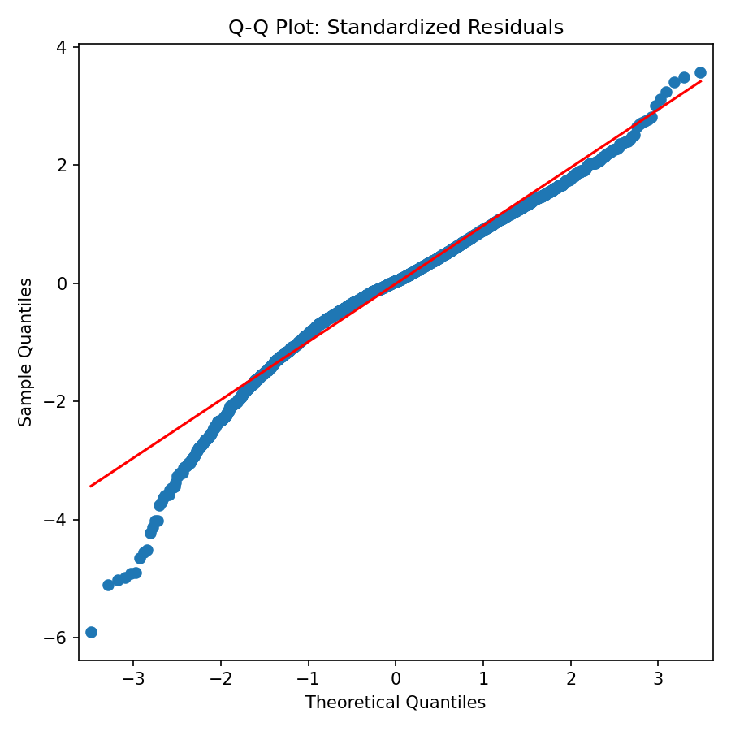

Plot notes:
- Residual series: clustered spikes indicate remaining structure after the fit.
- Residual ACF: residual and squared-residual autocorrelation shows incomplete mean and variance capture.
- Residual Q-Q: tail deviations from the diagonal suggest heavy tails and justify t-errors.

6) **Regime interpretation**  
   Conditional volatility is split into low/mid/high regimes using 33% and 66% quantiles (low <= 0.007292, high >= 0.009889). The realized volatility window that aligns best with VIX is 10 days.  
   The figures below show regime structure, implied vs realized comparison, and outcome summaries by regime.

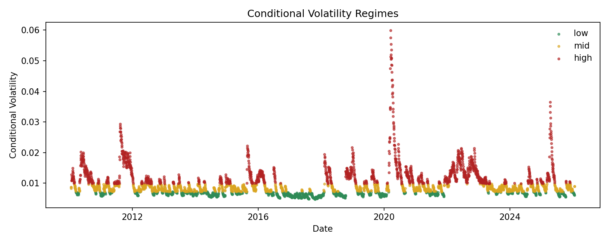
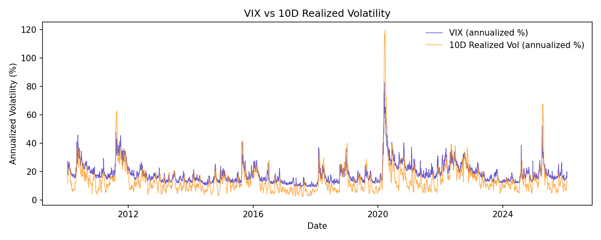
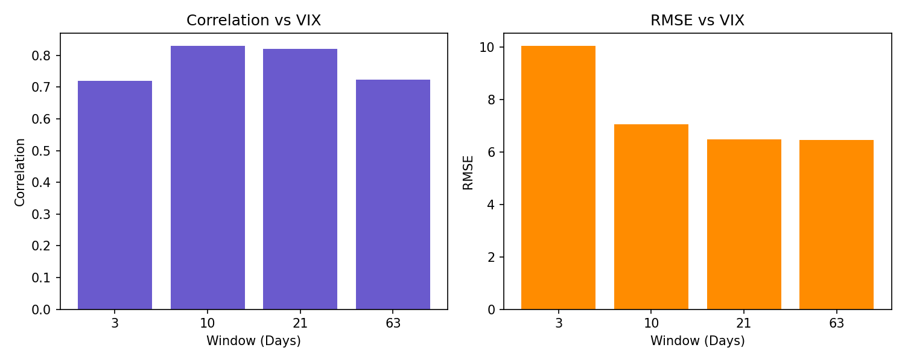
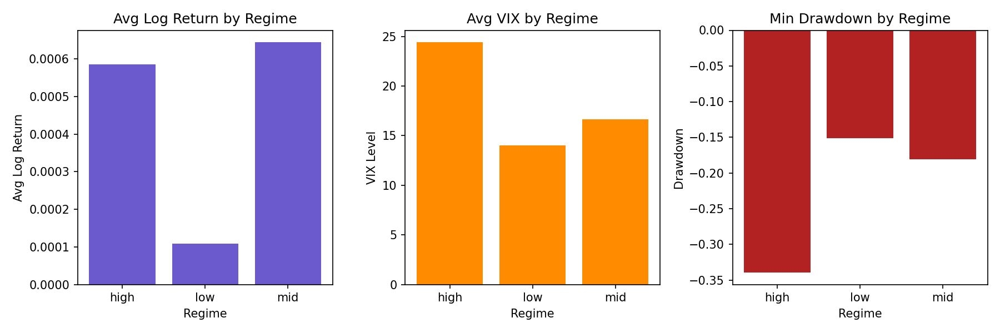

Plot notes:
- Regime scatter: long blocks show persistent volatility states; rapid flips indicate noisy transitions.
- VIX vs realized: alignment in peaks and troughs validates the realized window choice.
- Window metrics: the chosen window should sit near a stable correlation/RMSE tradeoff.
- Regime outcomes: high-vol regimes should show worse drawdowns and weaker returns.

7) **Out‑of‑sample check**  
   The holdout window is 2024‑01‑01 to 2026‑01‑01 (502 rows). With GARCH selected, both static and rolling forecasts are available; rolling out of sample correlation vs realized is 0.9193 with RMSE 3.2394 (static: corr 0.1696, RMSE 8.2674).  
   The rolling forecast plot below shows how well volatility is tracked in the holdout.
   This is a monitoring check, not a trading signal: directional tracking is the key success criterion.

Plot notes:
- The forecast should move in the same direction as realized volatility even if levels differ.
- Persistent gaps indicate scaling errors or a mismatch between model and realized window length.

8) **Hedge‑cost monitoring**  
   The hedge ratio (VIX / realized vol) flags expensive vs cheap hedging. Current thresholds are 1.056 (cheap) and 1.925 (expensive), with 20.00% of days cheap and 20.00% expensive. Average signal persistence is 4.6 days (cheap), 7.8 days (neutral), and 5.9 days (expensive).  
   Practical use: use the ratio as a budgeting signal (hedge more when cheap, hedge less or seek alternatives when expensive). See [reports/hedge_monitoring/README.md](https://github.com/Terraform05/ARMA-GARCH_EquityMarketVolatilityRegimeAnalysis/blob/main/reports/hedge_monitoring/README.md) for full tables and plots.

9) **Regime strategy backtest**  
   The baseline exposure rule (low=1.0, mid=0.75, high=0.25) yields annual return 0.0618, annual vol 0.0872, Sharpe 0.7085, and max drawdown -0.1234. Buy‑and‑hold returns 0.1128 with vol 0.1738 and max drawdown -0.3392.  
   The Sharpe‑best exposure map is low=1.0, mid=1.0, high=0.5 with Sharpe 0.7397.  
   Interpretation: the regime strategy sacrifices return for lower drawdowns and higher risk‑adjusted performance. If your objective is pure return, buy‑and‑hold wins; if your objective is risk control, the strategy helps. See [reports/strategy_backtest/README.md](https://github.com/Terraform05/ARMA-GARCH_EquityMarketVolatilityRegimeAnalysis/blob/main/reports/strategy_backtest/README.md) for the equity curve and variant table.

Key short‑horizon visuals (last 12 months, rebased to the same start):
- Black line: buy‑and‑hold equity curve.
- Slate‑blue line: regime strategy equity curve.
- Regime strip colors: green = low, amber = mid, red = high volatility.
- Exposure values (1.0, 0.75, 0.25) are fractions of full equity exposure.

The exposure overlay shows how the regime labels drive risk scaling: exposure rises in low‑volatility regimes and falls in high‑volatility regimes.

Plot notes:
- Equity curve (last year): the regime line should dip less during drawdowns if the overlay is working.
- Exposure overlay (last year): exposure steps down in high-volatility regimes and rises in low-volatility regimes.

Full‑sample views for context:

Plot notes:
- Equity curve (full sample): expect lower terminal value but materially smaller drawdowns vs buy-and-hold.
- Exposure overlay (full sample): long red blocks should align with reduced exposure plateaus.

10) **Regime-Trend strategy (regime + trend) backtest**  
   The regime-trend strategy combines volatility regimes with a 21‑day trend signal. The sweep winner uses an aggressive exposure map and daily rebalancing. It achieves annual return 0.1825, annual vol 0.0951, Sharpe 1.9205, and max drawdown -0.0903, versus buy‑and‑hold at 0.1128 return, 0.1738 vol, and -0.3392 drawdown.  
   Trend‑only baseline returns 0.1908 with vol 0.1090 and max drawdown -0.1527, so regime-trend trades a bit of return for much smoother risk.  
   Interpretation: the trend layer adds return while regimes cap risk, producing both higher CAGR and lower drawdown in this sample. See [reports/strategy_regime_trend/README.md](https://github.com/Terraform05/ARMA-GARCH_EquityMarketVolatilityRegimeAnalysis/blob/main/reports/strategy_regime_trend/README.md) for full comparisons and diagnostics.

Key short‑horizon visuals (last 12 months, rebased to the same start):
- Black line: buy‑and‑hold equity curve.
- Slate‑blue line: regime-trend strategy equity curve.
- Trend strip colors: green = strong up, gray = neutral, red = strong down.
- Regime strip colors: green = low, amber = mid, red = high volatility.

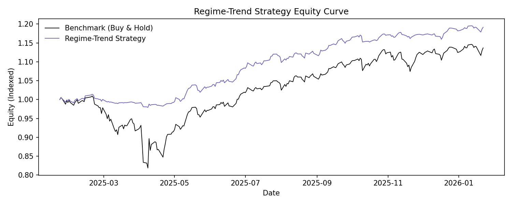

The exposure overlay shows how trend and regime signals combine to set exposure.

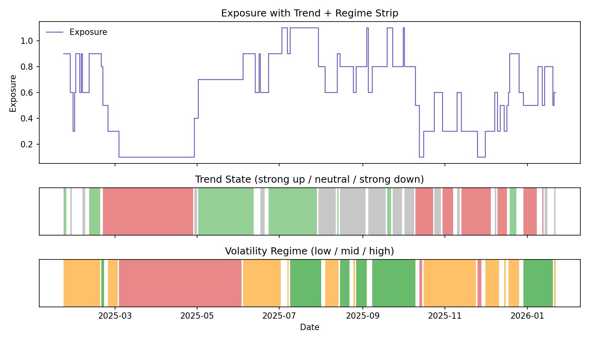

Plot notes:
- Equity curve (last year): regime-trend should recover faster than buy-and-hold if trend re-risking is working.
- Exposure overlay (last year): exposure reacts to both trend shifts and regime changes, not just volatility.

Full‑sample views for context:

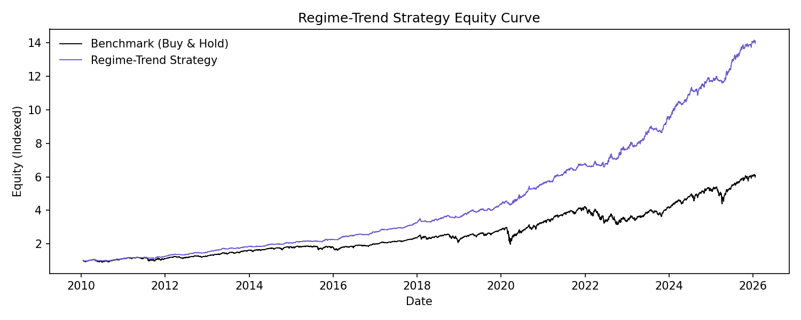

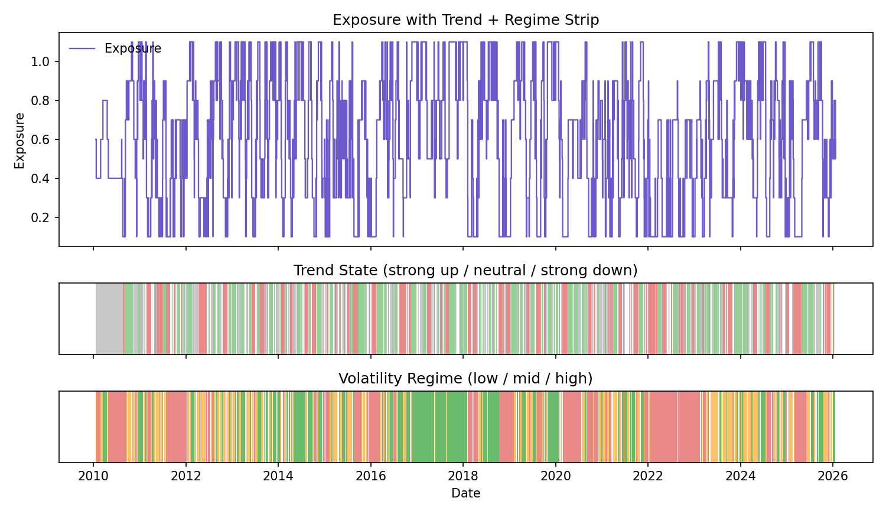

Plot notes:
- Equity curve (full sample): regime-trend should compound faster while keeping drawdowns shallower.
- Exposure overlay (full sample): green trend regimes with low vol should map to higher exposure.

11) **Regime-Trend diagnostics and alpha/beta**  
   Rolling diagnostics confirm the regime-trend edge is persistent, not a one‑off spike: 1Y/3Y rolling CAGR stays above the benchmark for most of the sample, and rolling max drawdown remains materially lower than buy‑and‑hold. The comparison plot includes trend‑only and regime‑only baselines to isolate incremental value. Alpha/beta computed on simple returns show annualized alpha 0.1290 (net 0.1191 at 5 bps) with beta ~0.45, meaning the strategy delivers excess return with lower market exposure.  
   Turnover is moderate (avg daily turnover 0.0788, annualized 19.86), with an estimated annual cost drag of ~0.0099 at 5 bps. The cost sensitivity plot shows a roughly linear decline in net return as costs rise.

Key diagnostics (full sample):

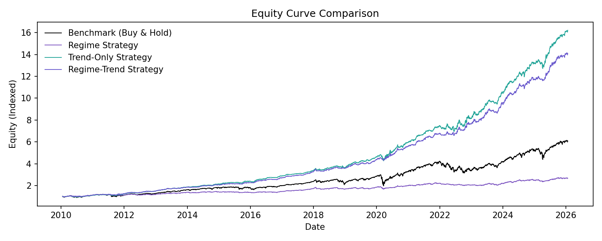
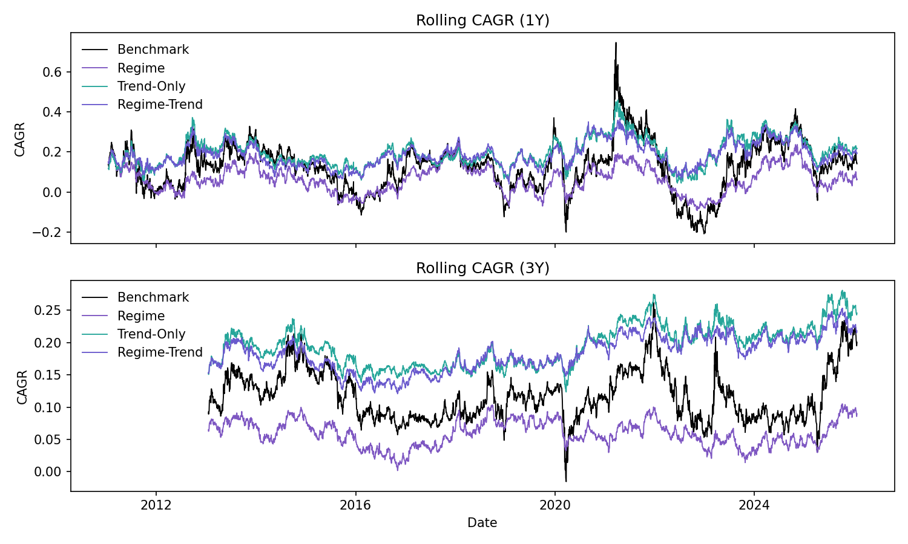
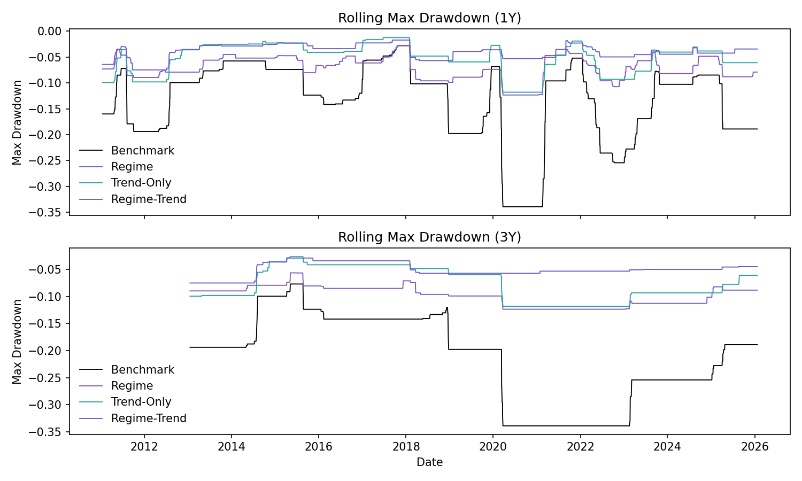
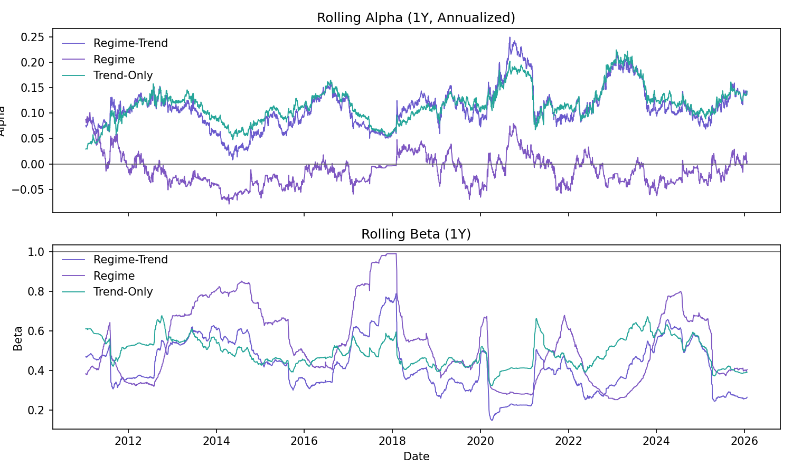
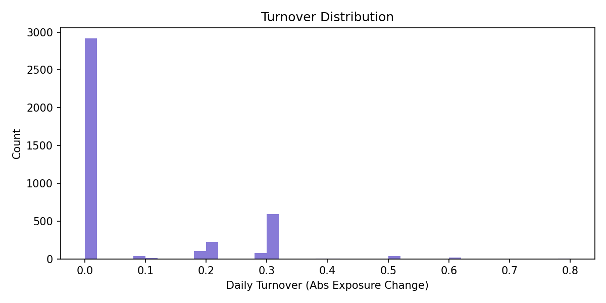
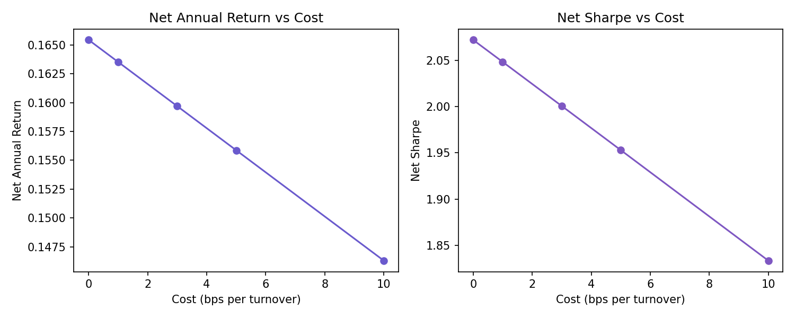

Plot notes:
- Equity curve comparison: trend-only usually tops returns; regime-trend trades some return for smoother risk.
- Rolling CAGR: regime-trend stays above benchmark in most windows; trend-only is higher but noisier.
- Rolling drawdown: regime-trend drawdowns are consistently shallower than benchmark and trend-only.
- Rolling alpha/beta: regime-trend alpha is positive for long stretches while beta stays below 1.0.
- Turnover distribution: most days show low turnover with occasional spikes during regime or trend flips.
- Cost sensitivity: net return and Sharpe decline roughly linearly with higher cost bps.

12) **GBM forward test (synthetic paths)**  
   Forward simulations using geometric Brownian motion provide a rough sanity check across 1Y/3Y/5Y horizons. The regime-trend strategy, regime‑only baseline, and buy‑and‑hold are all evaluated on identical simulated paths. This is not a realistic regime model, but it helps test robustness under a simple stochastic assumption.  
   See [reports/strategy_regime_trend_gbm/README.md](https://github.com/Terraform05/ARMA-GARCH_EquityMarketVolatilityRegimeAnalysis/blob/main/reports/strategy_regime_trend_gbm/README.md) for distributions and outperformance rates.

GBM diagnostics (synthetic):

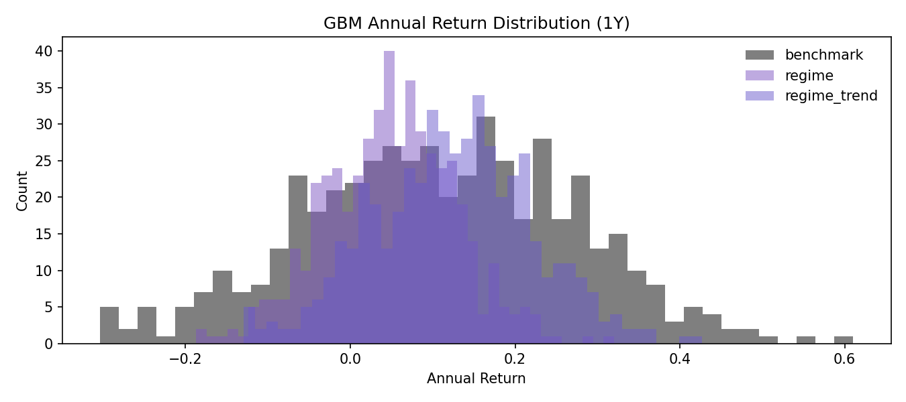
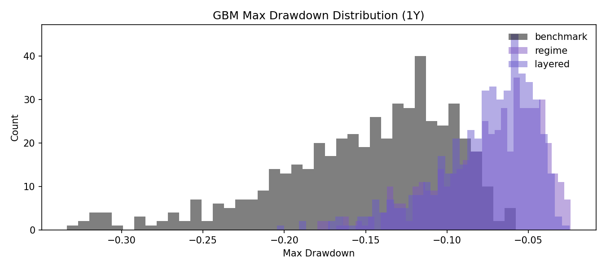

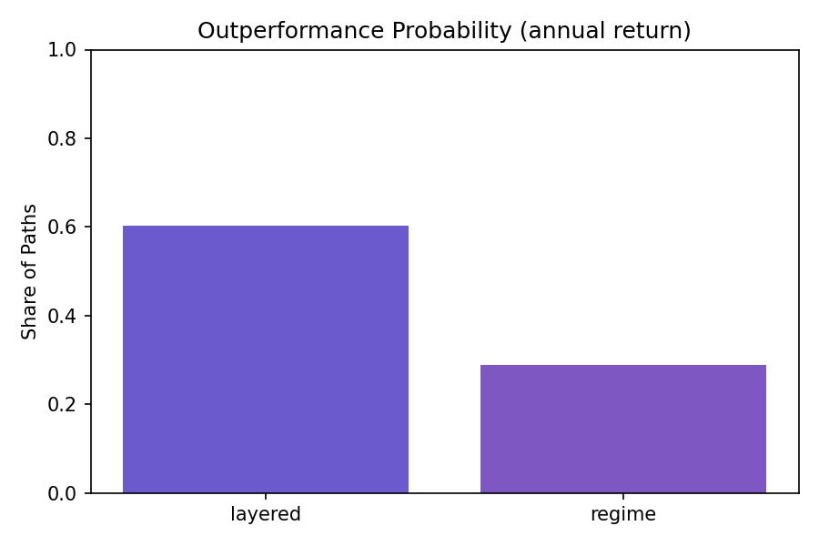

Plot notes:
- Return distribution: a right shift for regime-trend vs benchmark implies higher outperformance odds under GBM.
- Drawdown distribution: regime-trend should cluster toward smaller drawdowns if exposure control helps.
- Alpha distribution: mass above zero indicates positive alpha frequency in simulated paths.
- Outperformance: values above 0.5 indicate more than half the paths beat the benchmark.

## Actionable Next Steps

- **Risk control:** use regime labels to scale exposure or to set hedge budgets before stress periods, then review hedge ratio signals for timing.
- **Model choice:** choose BIC‑best (EGARCH_t) for in‑sample fit or tracking‑best (GARCH) when the goal is aligning with realized volatility.
- **Strategy tuning:** evaluate the Sharpe‑optimized exposure map from [reports/strategy_backtest/data/strategy_variants.csv](https://github.com/Terraform05/ARMA-GARCH_EquityMarketVolatilityRegimeAnalysis/blob/main/reports/strategy_backtest/data/strategy_variants.csv), then rerun to confirm stability.
- **Hold vs strategy:** if you only care about total return, buy‑and‑hold wins in this sample; if drawdown control matters, the regime strategy is the better fit.

## Scope

- Underlying: S&P 500 Index returns (SPX)
- Volatility benchmark: VIX Index (implied volatility)
- Horizon: 10–20+ years with low-vol, crisis, and transitional regimes

## Documentation

- [Data preparation](docs/pipeline/01_data_prep.md)
- [Preliminary diagnostics](docs/pipeline/02_diagnostics.md)
- [ARMA + GARCH modeling](docs/pipeline/03_modeling.md)
- [Model validation](docs/pipeline/04_validation.md)
- [Regime interpretation](docs/pipeline/05_regime_analysis.md)
- [Out-of-sample check](docs/pipeline/06_oos_check.md)
- [Executive summary](https://github.com/Terraform05/ARMA-GARCH_EquityMarketVolatilityRegimeAnalysis/blob/main/reports/summary.md)
- [Insights report](https://github.com/Terraform05/ARMA-GARCH_EquityMarketVolatilityRegimeAnalysis/blob/main/reports/insights.md)
- [Modeling variants](https://github.com/Terraform05/ARMA-GARCH_EquityMarketVolatilityRegimeAnalysis/blob/main/reports/modeling_variants/README.md)
- [Hedge cost monitoring](https://github.com/Terraform05/ARMA-GARCH_EquityMarketVolatilityRegimeAnalysis/blob/main/reports/hedge_monitoring/README.md)
- [Regime strategy backtest](https://github.com/Terraform05/ARMA-GARCH_EquityMarketVolatilityRegimeAnalysis/blob/main/reports/strategy_backtest/README.md)
- [Regime-Trend strategy backtest](https://github.com/Terraform05/ARMA-GARCH_EquityMarketVolatilityRegimeAnalysis/blob/main/reports/strategy_regime_trend/README.md)
- [Regime-Trend strategy GBM forward test](https://github.com/Terraform05/ARMA-GARCH_EquityMarketVolatilityRegimeAnalysis/blob/main/reports/strategy_regime_trend_gbm/README.md)
- [Hedge + strategy overview](https://github.com/Terraform05/ARMA-GARCH_EquityMarketVolatilityRegimeAnalysis/blob/main/reports/hedge_strategy/README.md)

## Run All

- `python scripts/run_all.py`

## Key Outputs

- `data/processed/spx_vix_aligned.csv`
- [reports/diagnostics/README.md](https://github.com/Terraform05/ARMA-GARCH_EquityMarketVolatilityRegimeAnalysis/blob/main/reports/diagnostics/README.md)
- [reports/modeling/README.md](https://github.com/Terraform05/ARMA-GARCH_EquityMarketVolatilityRegimeAnalysis/blob/main/reports/modeling/README.md)
- [reports/modeling_variants/README.md](https://github.com/Terraform05/ARMA-GARCH_EquityMarketVolatilityRegimeAnalysis/blob/main/reports/modeling_variants/README.md)
- [reports/validation/README.md](https://github.com/Terraform05/ARMA-GARCH_EquityMarketVolatilityRegimeAnalysis/blob/main/reports/validation/README.md)
- [reports/regime_analysis/README.md](https://github.com/Terraform05/ARMA-GARCH_EquityMarketVolatilityRegimeAnalysis/blob/main/reports/regime_analysis/README.md)
- [reports/oos_check/README.md](https://github.com/Terraform05/ARMA-GARCH_EquityMarketVolatilityRegimeAnalysis/blob/main/reports/oos_check/README.md)
- [reports/insights.md](https://github.com/Terraform05/ARMA-GARCH_EquityMarketVolatilityRegimeAnalysis/blob/main/reports/insights.md)
- [reports/hedge_monitoring/README.md](https://github.com/Terraform05/ARMA-GARCH_EquityMarketVolatilityRegimeAnalysis/blob/main/reports/hedge_monitoring/README.md)
- [reports/strategy_backtest/README.md](https://github.com/Terraform05/ARMA-GARCH_EquityMarketVolatilityRegimeAnalysis/blob/main/reports/strategy_backtest/README.md)
- [reports/strategy_regime_trend/README.md](https://github.com/Terraform05/ARMA-GARCH_EquityMarketVolatilityRegimeAnalysis/blob/main/reports/strategy_regime_trend/README.md)
- [reports/strategy_regime_trend_gbm/README.md](https://github.com/Terraform05/ARMA-GARCH_EquityMarketVolatilityRegimeAnalysis/blob/main/reports/strategy_regime_trend_gbm/README.md)
- [reports/hedge_strategy/README.md](https://github.com/Terraform05/ARMA-GARCH_EquityMarketVolatilityRegimeAnalysis/blob/main/reports/hedge_strategy/README.md)
