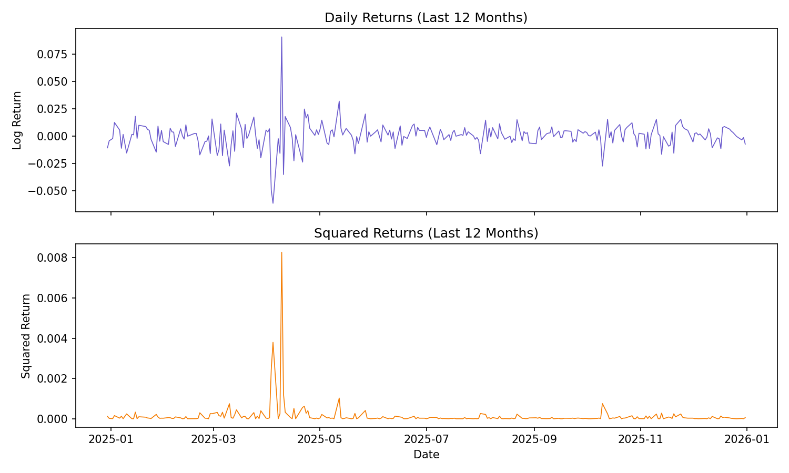
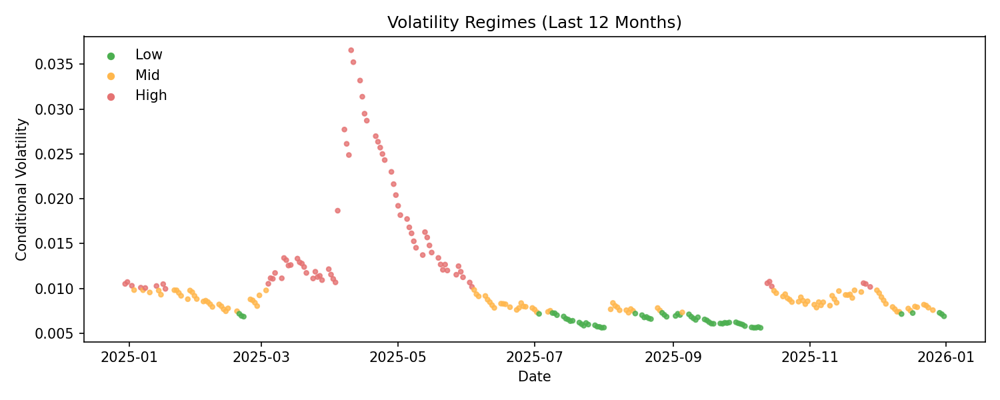
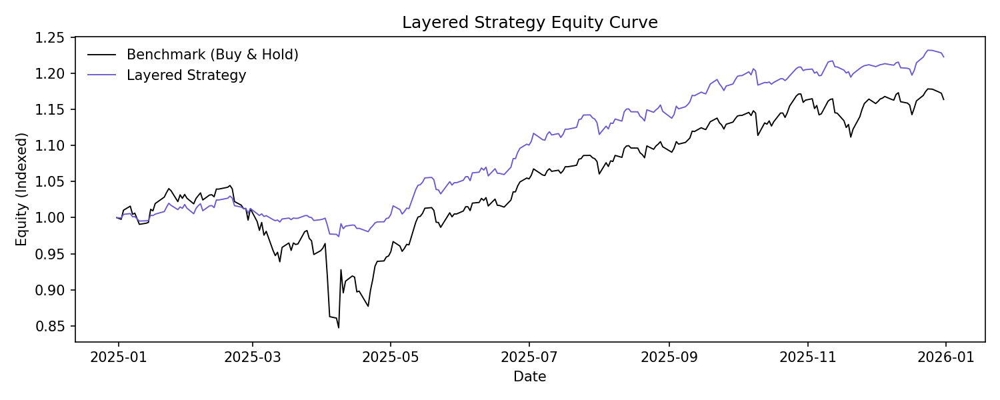
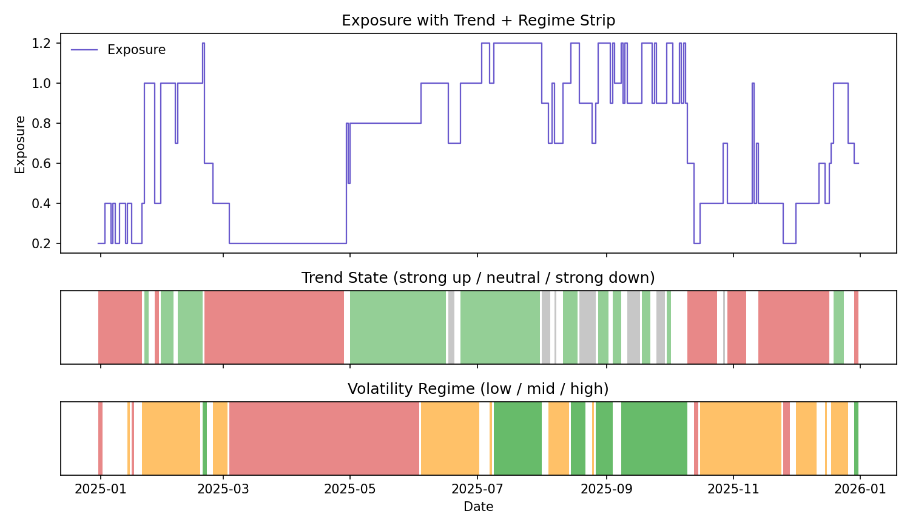
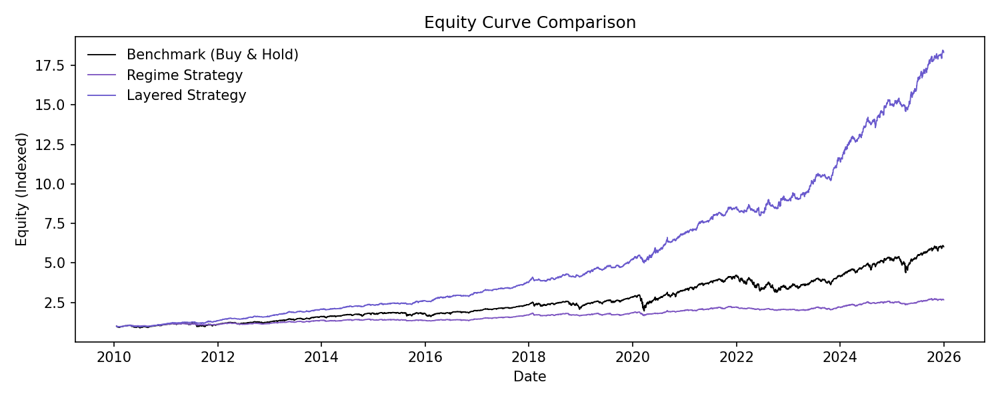
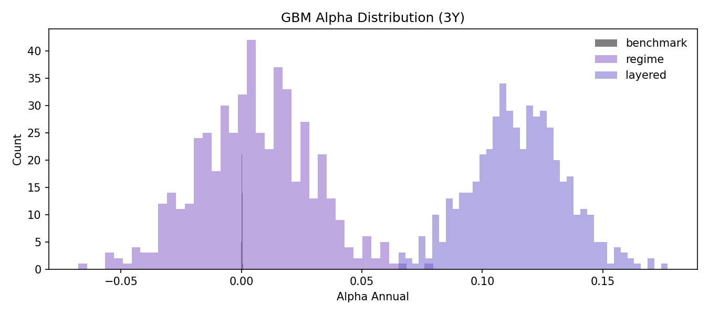

# Layman's README (Plain-English Summary)

This project studies S&P 500 volatility and builds a simple, rules-based
strategy that changes how much stock exposure it takes based on (1) how
**jumpy or calm the market is** and (2) whether prices are **trending up or
down**. The goal is to **beat buy-and-hold while keeping drawdowns smaller**.

## Big Idea (In One Paragraph)

Markets move up and down, but the risk level changes over time. This project
measures that risk using a volatility model, labels each day as **calm,
normal, or stress**, and then adds a **trend signal** so exposure increases
when prices are rising and decreases when prices are falling. **In plain
terms: we buy more when things look calm and rising, and we step back when
things look risky or falling.** The layered approach aims to capture upside
while avoiding the worst drawdowns.

## What Data Is Used

- S&P 500 prices (to compute returns and trend)
- VIX (to compare implied volatility to realized volatility)

## How It Works (Simple Steps)

1) Measure daily returns from prices.
2) Estimate volatility with a GARCH model (how jumpy the market is).
3) Classify each day into **low, mid, or high** volatility regimes.
4) Measure trend using a 21-day price change (is the market rising or falling?).
5) Combine regime and trend to set **exposure** (how much of the portfolio is in stocks).

## Quick Definitions (Plain English)

- **S&P 500**: a big basket of large U.S. stocks; used as the main market.
- **VIX**: a market index that reflects expected volatility in the S&P 500.
- **Volatility**: how much prices jump around day to day.
- **Regime**: a simple label for volatility (calm, normal, stress).
- **Trend**: whether prices have been rising or falling lately.
- **Exposure**: how much of the portfolio is in stocks (1.0 = fully invested).
- **Drawdown**: how far the strategy fell from its most recent high.
- **Sharpe**: return per unit of risk (higher is better).
- **Alpha**: extra return that is not explained by market moves.
- **Beta**: how much the strategy moves when the market moves.
- **Benchmark / buy-and-hold**: holding the S&P 500 the whole time.
- **Backtest**: testing a strategy on historical data (not a guarantee).
- **Equity curve**: a line chart of how $1 grows over time.
- **Turnover**: how much the exposure changes from day to day.
- **Cost in bps**: trading cost in basis points; 1 bp = 0.01%.
- **Annualized**: scaled to a per-year rate for comparison.
- **Rolling (1Y/3Y)**: recalculated over a moving window, not fixed dates.
- **Leverage**: using more than 100% exposure (e.g., 1.2 = 120%).

## Key Results (Annualized)

Source: `reports/strategy_layered/data/summary.txt` and
`reports/strategy_backtest/data/summary.txt`.

| Strategy | Annual return | Volatility | Sharpe | Max drawdown | Notes |
| --- | --- | --- | --- | --- | --- |
| Layered (gross) | 18.25% | 9.51% | 1.92 | -9.03% | Best risk-adjusted balance |
| Layered (net, 5 bps costs) | 17.26% | 9.50% | 1.82 | -9.08% | Cost drag is modest |
| Trend-only | 19.08% | 10.90% | 1.75 | -15.27% | Higher return, more drawdown |
| Regime-only | 6.18% | 8.72% | 0.71 | -12.34% | Risk control, weaker return |
| Buy-and-hold | 11.28% | 17.38% | 0.65 | -33.92% | High return, large drawdown |

Plain-English takeaway:
- **Trend-only makes the most money but swings more.**
- **Layered gives up a little return for much smoother risk.**
- **Regime-only protects in stress but gives up too much upside.**
- **Buy-and-hold has the deepest drawdowns.**

## Key Graphs (Essential Only)

**All time-series graphs below use the last 12 months for easier reading,**
except the full-sample comparison (requested) and the cost chart.

### 1) Volatility shows up in clusters (last 12 months)

What to notice:
- **Big spikes in squared returns mean risk comes in bursts.**
- **This is why we model volatility instead of assuming risk is constant.**

### 2) Regimes over time (last 12 months)

What to notice:
- **Colors show calm (low), normal (mid), and stress (high) days.**
- **The strategy uses these labels to scale risk up or down.**

### 3) Last-year performance comparison (all strategies)

What to notice:
- **Trend-only is highest, but layered is close with smoother behavior.**
- **Regime-only stays low (defensive but lower return).**
- **Layered beats buy-and-hold while taking less risk.**

### 4) Last-year layered vs buy-and-hold (simpler view)

What to notice:
- **Layered should dip less during drawdowns and recover faster.**
- The gap shows how much risk control helps in a tough window.

### 5) Last-year exposure behavior (what the strategy is doing)

What to notice:
- **Exposure drops quickly when volatility is high or trend is down.**
- **Exposure rises when things are calm and trending up.**
- This is the core "risk-on / risk-off" behavior in action.

### 6) Full-sample performance comparison (long-run view)

What to notice:
- **Over the full history, layered stays well above buy-and-hold.**
- Trend-only ends higher but takes larger drawdowns along the way.

### 7) Alpha and beta over time (last 12 months)

What to notice:
- **Alpha above zero means the strategy beat what market exposure alone would explain.**
- **Beta below 1.0 means the strategy takes less market risk than buy-and-hold.**

### 8) Trading cost impact

What to notice:
- **Costs reduce returns in a roughly straight line.**
- **Even at 10 bps per turnover, layered still holds a meaningful edge.**

### 9) Simple forward-looking stress test (GBM)

What to notice:
- **Alpha above zero means extra return beyond simple market exposure.**
- **More mass to the right of zero means the strategy adds value more often.**
- This is a rough stress test, not a real forecast.

## Alpha/Beta (Very Simple Explanation)

- **Beta** is like a volume knob for market movement.
  - **Beta 1.0**: you move with the market (same ups and downs).
  - **Beta 0.5**: you feel about half the market swings.
  - **Beta 0.0**: you are not moving with the market at all.
  - Example: **if the market rises 10% and beta is 0.45, the strategy rises
    about 4.5% from market exposure alone.**
- **Alpha** is the extra return **on top of** what beta would predict.
  - It is the part explained by the strategy rules, not just market movement.
  - Think of it as “skill” beyond simply being invested.

Layered strategy results (this backtest):
- **Beta ~ 0.45**: the strategy takes about half the market risk.
- **Alpha ~ 12.9% annualized**: performance beyond what market exposure explains.

Plain-English takeaway:
- **The strategy is not just "more market." It earns extra return while
  taking less market exposure than buy-and-hold.**

## If You Only Read One Thing

**The layered strategy (trend + regime) is the best balance in this sample:**
it beats buy-and-hold while cutting drawdowns dramatically. Trend-only makes
more money but takes more risk. Regime-only reduces risk but sacrifices too
much return. **Layered is the middle ground that still wins.**
