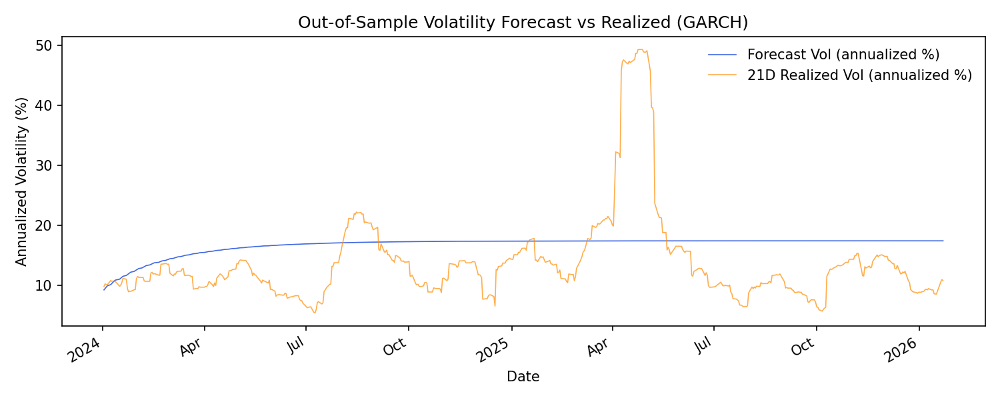

# Plots

This document describes the plots and where they live. All plots are generated under `reports/` and are overwritten on each run. See `reports/README.md` for the current index.

## Diagnostics

Plot notes:
- Returns and squared returns: squared returns cluster into bursts, showing volatility clustering and motivating GARCH.
- ACF and PACF: return autocorrelation decays quickly, but squared returns persist, indicating volatility dynamics.

## Model Variants and Selection

Plot notes:
- Variant comparison: top models co-move in calm periods; stress windows reveal divergence.
- Variants vs realized: closest tracking line indicates best realized-vol alignment.
- Variant metrics: lower (more negative) AIC/BIC is better, but only relative differences matter.
- Best variant volatility: the conditional vol path should spike during stress and mean-revert after.
- BIC vs tracking: the tradeoff shows whether you are optimizing fit or realized-vol tracking.

## Modeling

- `reports/modeling/data/conditional_volatility.csv` (series used for regimes)

## Validation

Plot notes:
- Residual series: clustered spikes indicate remaining structure after the fit.
- Residual ACF: residual and squared-residual autocorrelation shows incomplete mean and variance capture.
- Residual Q-Q: tail deviations from the diagonal suggest heavy tails and justify t-errors.

## Regime Analysis

Plot notes:
- Regime scatter: long blocks show persistent volatility states; rapid flips indicate noisy transitions.
- VIX vs realized: alignment in peaks and troughs validates the realized window choice.
- Window metrics: the chosen window should sit near a stable correlation/RMSE tradeoff.
- Regime outcomes: high-vol regimes should show worse drawdowns and weaker returns.

## Out-of-Sample Check

Plot notes:
- The forecast should move in the same direction as realized volatility even if levels differ.
- Persistent gaps indicate scaling errors or a mismatch between model and realized window length.

## Hedge Monitoring

Plot notes:
- Hedge ratio: highlights windows where hedging is cheap vs expensive.
- VIX vs realized: use this as context for hedge-cost regimes.

## Regime Strategy Backtest

Plot notes:
- Equity curve (last year): the regime line should dip less during drawdowns if the overlay is working.
- Exposure overlay: exposure steps down in high-volatility regimes and rises in low-volatility regimes.
- Rolling alpha/beta: sanity-check that alpha is not isolated to a single window.

## Regime-Trend Strategy Backtest

Plot notes:
- Equity curve comparison: trend-only usually tops returns; regime-trend trades some return for smoother risk.
- Rolling drawdown: regime-trend drawdowns are consistently shallower than benchmark and trend-only.
- Cost sensitivity: net return and Sharpe decline roughly linearly with higher cost bps.

## Regime-Trend Sweep

- `reports/strategy_regime_trend_sweep/data/sweep_results.csv`
- `reports/strategy_regime_trend_sweep/data/top_candidates.csv`

Use these to review the hyperparameter rankings and see which configs were selected.
