# Out of sample run report - aram_last_year (2025-01-21 to 2026-01-21)

## Abstract - Last year project

This report summarizes a last-year out of sample run that trains on the prior year and evaluates the 2025-01-21 to 2026-01-21 window. The April 2025 tariff shock and subsequent policy reversals and fast headline shifts dominate the volatility regime, driving a sharp spike in conditional variance, a high-vol regime cluster, and a clear separation between implied and realized volatility. Rolling forecasts track the shock faster than static forecasts, while regime-based exposure cuts reduce drawdown depth at the cost of lower total return versus buy-and-hold. Event chronologies below tie each key plot to the policy and macro catalysts that shaped the risk environment.

This report summarizes the last-year out of sample run stored in this folder. All plots are included below with brief explanations and run-specific metrics.

## Run metadata

- Run folder: `oos_runs/aram_last_year/2025-01-21_to_2026-01-21/20260121_111845`
- Data coverage: 2024-01-23 to 2026-01-21 (501 rows)
- Training window: 2024-01-23 to 2025-01-17 (249 rows)
- Evaluation (out of sample) window: 2025-01-21 to 2026-01-21 (252 rows)
- Mean model: ARMA(0,1) selected on training data (BIC = -1675.050517)
- Volatility model: tracking-best GARCH (lowest RMSE vs realized vol)
- BIC-best variant (reference only): EGARCH_t

## Key metrics

- Diagnostics (training): ADF stat -15.326080 (p=0.000000), ARCH stat 21.374728 (p=0.375379)
- GARCH params (training): omega 0.000006, alpha 0.070494, beta 0.831663, alpha+beta 0.902157
- Validation (training, standardized residuals): LB stat 18.588901 (p=0.548674), LB^2 stat 7.705294 (p=0.993645), ARCH stat 8.294066 (p=0.989737)
- out of sample performance: static corr -0.0334 (rmse 10.6947), rolling corr 0.8107 (rmse 6.0586)
- Regimes: low <= 0.007564, high >= 0.009332; realized window = 10 days
- Strategy vs benchmark (out of sample): annual return 5.17% vs 13.31%, max drawdown -7.90% vs -18.90%
- Hedge ratios (out of sample): cheap <= 1.105, expensive >= 2.104; signal mix ~20%/60%/20%

## Event annotation anchors

These anchors map spikes/drawdowns to major headlines. Use the "User-supplied context (integrated)" section below for the full narrative, expanded event table, and source links.

### Largest realized-volatility spikes (21D annualized, out of sample window)

| Date | Realized vol (%) | Event notes |
| --- | --- | --- |
| 2025-04-28 | 49.28 | Markets braced for a macro-heavy week under tariff uncertainty; recession risk narratives rose. |
| 2025-04-25 | 49.28 | Easing trade-war hopes mixed with fragile macro expectations kept dispersion high. |
| 2025-04-24 | 49.28 | Rebound on tech/earnings while watching tariff-standoff progress. |
| 2025-05-02 | 49.08 | Jobs report: payrolls slowed but beat; "resilient labor" helped stabilize risk. |
| 2025-04-29 | 48.87 | Choppy trade as investors digested mixed earnings/data and tariff noise. |

### Largest rolling-forecast spikes (annualized, out of sample window)

| Date | Forecast vol (%) | Event notes |
| --- | --- | --- |
| 2025-04-10 | 67.81 | Post-pause sharp reversal lower; CPI softer but tariff-inflation risk dominated. |
| 2025-04-11 | 57.45 | Fed talk emphasized tariff-driven inflation risk; PPI day kept tension elevated. |
| 2025-04-14 | 54.10 | Electronics exemptions sparked a relief bid, but policy uncertainty remained. |
| 2025-04-15 | 50.56 | "Breather" conditions from tariff reprieve plus softer Fed tone. |
| 2025-04-16 | 49.68 | Retail sales surged on pull-forward demand; Fed tradeoff language sharpened. |

### Deepest strategy drawdowns (out of sample window)

| Date | Drawdown | Event notes |
| --- | --- | --- |
| 2025-04-08 | -0.0790 | Escalation toward 104% China-linked tariffs reinforced tail-risk hedging. |
| 2025-04-07 | -0.0754 | Continued digestion of the tariff shock kept risk premia wide. |
| 2025-04-04 | -0.0748 | Tariff panic period; payroll strength did not offset trade-shock fear. |
| 2025-04-21 | -0.0710 | Fed-independence concerns (pressure on Powell) layered on tariff anxiety. |
| 2025-04-10 | -0.0661 | Violent reversal after pause rally; uncertainty stayed maximal. |

## User-supplied context (integrated)

### April 2025 narrative (for the run)

April 2025 was a classic policy-shock volatility regime: an abrupt escalation in U.S. "Liberation Day" tariffs triggered a sharp risk-off selloff, then a series of rapid back-and-forth reversals (tariff pauses/exemptions, shifting negotiation headlines) repeatedly reset growth/inflation priors. Mid-month, inflation prints (CPI/PPI) and Fed communications/minutes reframed the shock as potentially stagflationary (higher inflation risk + weaker growth), amplifying option-implied and realized vol. Late April into early May, risk partially stabilized on tariff-easing headlines + resilient U.S. data (retail sales; later jobs), but the tape remained jumpy into major macro catalysts (GDP/PCE/jobs) and renewed Fed-independence concerns.

### Event table (anchor-adjacent catalysts)

| Date | Event summary | Source link |
| --- | --- | --- |
| 2025-04-02 | "Liberation Day" tariff announcement set off immediate global risk-off and recession/trade-war repricing. | |
| 2025-04-04 | Jobs report landed amid tariff panic; strong payrolls did not offset trade-shock risk (risk assets still unstable). | |
| 2025-04-08 | U.S. forged ahead with 104% China-linked tariffs; escalation narrative reinforced recession/tail-risk hedging. | |
| 2025-04-09 | FOMC minutes (Mar meeting): broad concern risks tilted toward higher inflation / slower growth; same day saw a major tariff-pause relief rally. | |
| 2025-04-10 | Rapid reversal: after the prior day's relief rally, stocks sold off hard as tariff uncertainty persisted; CPI (Mar) printed softer, but tariff-inflation risk dominated the narrative. | |
| 2025-04-11 | Fed talk emphasized tariff-driven inflation risk; PPI day kept "inflation vs growth" tension elevated. | |
| 2025-04-14 | White House exempted some electronics (e.g., smartphones/computers) from new tariffs; equities rebounded (tech leadership), tempering immediate trade-shock intensity. | |
| 2025-04-15 | "Breather" conditions: tariff reprieve + comparatively dovish Fed tone reduced near-term stress (but uncertainty remained). | |
| 2025-04-16 | Retail sales surged as consumers pulled forward purchases ahead of tariffs; Fed commentary increasingly framed a difficult tradeoff (inflation control vs supporting growth/jobs). | |
| 2025-04-21 | Renewed drawdown pressure tied to Fed-independence concerns (Trump attacks/pressure on Powell) layered on top of tariff anxiety; classic risk premium re-widening day. | |
| 2025-04-24 | Risk assets extended a rebound on tech/earnings with markets watching for progress in the tariff standoff; Fed officials emphasized patience while assessing tariff effects. | |
| 2025-04-28 | Markets braced for a macro-heavy week under tariff uncertainty; recession-risk narratives rose in surveys/polls and the dollar weakened amid policy doubt. | |
| 2025-04-29 | Choppy trade as investors digested mixed earnings/data and tried to separate signal from tariff noise (hard to discern tariff impacts). | |
| 2025-04-30 | Q1 GDP contracted (import surge ahead of tariffs), reinforcing stagflation-risk framing into month-end macro. | |
| 2025-05-02 | April jobs report: payroll growth slowed but beat expectations; resilient labor market helped risk stabilize vs worst-case recession fears. | |

### Anchor-date explanations (tie to vol spikes / drawdowns)

Rolling-forecast volatility spikes

- 2025-04-10: The post-pause sharp reversal lower plus CPI-day "good news is bad news" dynamics (tariff inflation risk > cooler print) is consistent with a sharp jump in forecasted conditional variance.
- 2025-04-11: Tariff-driven inflation repricing (Fed's Williams explicitly warning tariffs could lift inflation/unemployment) kept forward-looking volatility elevated into PPI-day.
- 2025-04-14: Electronics exemptions generated a relief bid, but the regime stayed policy-headline-dominated - a setup where forecast vol stays high even on up-days.
- 2025-04-15: Temporary calm from tariff reprieve + softer Fed tone can still register as high forecast vol because the market's state variable (policy uncertainty) remained unresolved.
- 2025-04-16: Retail-sales pull-forward and increasingly explicit Fed tradeoff language (inflation vs growth/jobs) reinforced two-sided tail risk, supporting elevated model-implied volatility.

Realized-volatility spikes

- 2025-04-24: A multi-day rebound (tech/earnings) amid ongoing tariff uncertainty produces larger intraday swings and gap risk - typical realized-vol acceleration in a headline regime.
- 2025-04-25: Easing trade-war hopes mixed with fragile macro expectations created a high-dispersion tape - supportive of realized vol despite index gains.
- 2025-04-28: Markets priced a macro-dense week under tariff uncertainty (growth scare narratives rising), a classic catalyst for higher realized vol as hedges roll and positioning resets.
- 2025-04-29: Choppy trading around mixed earnings/data and unclear tariff pass-through maps to elevated realized variance (directionless but wide ranges).
- 2025-05-02: Jobs report days often spike realized vol; here, slowing but still solid payrolls likely reduced recession tails but still forced repricing across rates/equities.

Strategy drawdown lows

- 2025-04-04: The drawdown low aligns with the peak tariff-shock liquidation period, when recession fears dominated and correlations jumped (risk parity / vol-control deleveraging conditions).
- 2025-04-07: Continued digestion of the tariff shock (and retaliation/escalation risk) likely kept risk premia wide, pressuring systematic exposures during unstable correlation/vol regimes.
- 2025-04-08: Escalation toward 104% tariffs on China reinforced tail-risk hedging and widened distributions - an environment where trend/vol strategies often struggle.
- 2025-04-10: The violent reversal after the 90-day pause rally (and "tariff pause = more uncertainty" interpretation) is consistent with drawdown extension in short-horizon systematic allocations.
- 2025-04-21: Fresh risk-off tied to Fed-independence concerns (pressure on Powell) layered on tariff uncertainty - an archetypal shock for rates vol + equity risk premium, often driving strategy troughs.

### User-provided News Context

April 2025 narrative (for the run)

April 2025 was a classic policy-shock volatility regime: an abrupt escalation in U.S. "Liberation Day" tariffs triggered a sharp risk-off selloff, then a series of rapid back-and-forth reversals (tariff pauses/exemptions, shifting negotiation headlines) repeatedly reset growth/inflation priors. Mid-month, inflation prints (CPI/PPI) and Fed communications/minutes reframed the shock as potentially stagflationary (higher inflation risk + weaker growth), amplifying option-implied and realized vol. Late April into early May, risk partially stabilized on tariff-easing headlines + resilient U.S. data (retail sales; later jobs), but the tape remained jumpy into major macro catalysts (GDP/PCE/jobs) and renewed Fed-independence concerns.

Event table (anchor-adjacent catalysts)

| Date | Event summary | Source link |
| --- | --- | --- |
| 2025-04-02 | "Liberation Day" tariff announcement set off immediate global risk-off and recession/trade-war repricing. | |
| 2025-04-04 | Jobs report landed amid tariff panic; strong payrolls did not offset trade-shock risk (risk assets still unstable). | |
| 2025-04-08 | U.S. forged ahead with 104% China-linked tariffs; escalation narrative reinforced recession/tail-risk hedging. | |
| 2025-04-09 | FOMC minutes (Mar meeting): broad concern risks tilted toward higher inflation / slower growth; same day saw a major tariff-pause relief rally. | |
| 2025-04-10 | Rapid reversal: after the prior day's relief rally, stocks sold off hard as tariff uncertainty persisted; CPI (Mar) printed softer, but tariff-inflation risk dominated the narrative. | |
| 2025-04-11 | Fed talk emphasized tariff-driven inflation risk; PPI day kept "inflation vs growth" tension elevated. | |
| 2025-04-14 | White House exempted some electronics (e.g., smartphones/computers) from new tariffs; equities rebounded (tech leadership), tempering immediate trade-shock intensity. | |
| 2025-04-15 | "Breather" conditions: tariff reprieve + comparatively dovish Fed tone reduced near-term stress (but uncertainty remained). | |
| 2025-04-16 | Retail sales surged as consumers pulled forward purchases ahead of tariffs; Fed commentary increasingly framed a difficult tradeoff (inflation control vs supporting growth/jobs). | |
| 2025-04-21 | Renewed drawdown pressure tied to Fed-independence concerns (Trump attacks/pressure on Powell) layered on top of tariff anxiety; classic risk premium re-widening day. | |
| 2025-04-24 | Risk assets extended a rebound on tech/earnings with markets watching for progress in the tariff standoff; Fed officials emphasized patience while assessing tariff effects. | |
| 2025-04-28 | Markets braced for a macro-heavy week under tariff uncertainty; recession-risk narratives rose in surveys/polls and the dollar weakened amid policy doubt. | |
| 2025-04-29 | Choppy trade as investors digested mixed earnings/data and tried to separate signal from tariff noise (hard to discern tariff impacts). | |
| 2025-04-30 | Q1 GDP contracted (import surge ahead of tariffs), reinforcing stagflation-risk framing into month-end macro. | |
| 2025-05-02 | April jobs report: payroll growth slowed but beat expectations; resilient labor market helped risk stabilize vs worst-case recession fears. | |

Anchor-date explanations (tie to vol spikes / drawdowns)

Rolling-forecast volatility spikes

- 2025-04-10: The post-pause sharp reversal lower plus CPI-day "good news is bad news" dynamics (tariff inflation risk > cooler print) is consistent with a sharp jump in forecasted conditional variance.
- 2025-04-11: Tariff-driven inflation repricing (Fed's Williams explicitly warning tariffs could lift inflation/unemployment) kept forward-looking volatility elevated into PPI-day.
- 2025-04-14: Electronics exemptions generated a relief bid, but the regime stayed policy-headline-dominated - a setup where forecast vol stays high even on up-days.
- 2025-04-15: Temporary calm from tariff reprieve + softer Fed tone can still register as high forecast vol because the market's state variable (policy uncertainty) remained unresolved.
- 2025-04-16: Retail-sales pull-forward and increasingly explicit Fed tradeoff language (inflation vs growth/jobs) reinforced two-sided tail risk, supporting elevated model-implied volatility.

Realized-volatility spikes

- 2025-04-24: A multi-day rebound (tech/earnings) amid ongoing tariff uncertainty produces larger intraday swings and gap risk - typical realized-vol acceleration in a headline regime.
- 2025-04-25: Easing trade-war hopes mixed with fragile macro expectations created a high-dispersion tape - supportive of realized vol despite index gains.
- 2025-04-28: Markets priced a macro-dense week under tariff uncertainty (growth scare narratives rising), a classic catalyst for higher realized vol as hedges roll and positioning resets.
- 2025-04-29: Choppy trading around mixed earnings/data and unclear tariff pass-through maps to elevated realized variance (directionless but wide ranges).
- 2025-05-02: Jobs report days often spike realized vol; here, slowing but still solid payrolls likely reduced recession tails but still forced repricing across rates/equities.

Strategy drawdown lows

- 2025-04-04: The drawdown low aligns with the peak tariff-shock liquidation period, when recession fears dominated and correlations jumped (risk parity / vol-control deleveraging conditions).
- 2025-04-07: Continued digestion of the tariff shock (and retaliation/escalation risk) likely kept risk premia wide, pressuring systematic exposures during unstable correlation/vol regimes.
- 2025-04-08: Escalation toward 104% tariffs on China reinforced tail-risk hedging and widened distributions - an environment where trend/vol strategies often struggle.
- 2025-04-10: The violent reversal after the 90-day pause rally (and "tariff pause = more uncertainty" interpretation) is consistent with drawdown extension in short-horizon systematic allocations.
- 2025-04-21: Fresh risk-off tied to Fed-independence concerns (pressure on Powell) layered on tariff uncertainty - an archetypal shock for rates vol + equity risk premium, often driving strategy troughs.

## Diagnostics (training window)

These plots check stationarity and short-lag structure in log returns used for model fitting. The training window ends before the April 2025 policy-shock period, so the context below applies primarily to the out of sample sections.

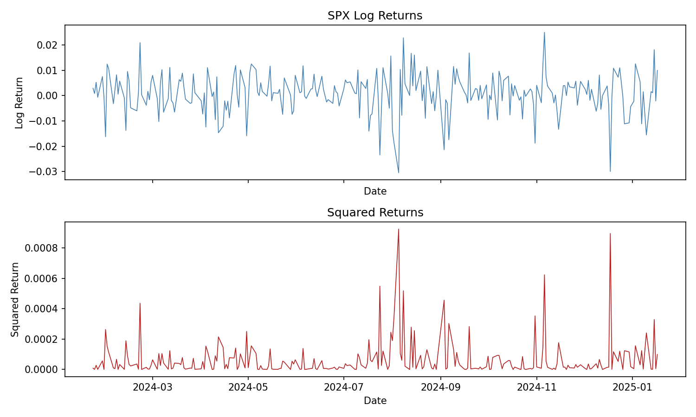
This shows daily SPX log returns (top) and squared returns (bottom). Clustering in the squared-return panel indicates volatility clustering, a key motivation for GARCH.
- Bursty squared-return blocks imply persistent volatility rather than isolated shocks.
- Quiet stretches indicate regimes where risk is compressed and shocks decay quickly.
- The absence of long trends in raw returns supports a mean-reverting return process.

Autocorrelation (ACF) and partial autocorrelation (PACF) for log returns. Low autocorrelation supports a simple ARMA structure; any spikes guide ARMA order selection.
- Small, short-lived spikes suggest limited short-run predictability in returns.
- ACF decay indicates whether lag effects persist or vanish quickly.
- PACF peaks help justify the selected ARMA order used in modeling.

## Modeling variants (training window)

These compare GARCH-family variants on the training data, including realized-vol tracking. This is the pre-shock baseline used to interpret the April 2025 out of sample regime shift.

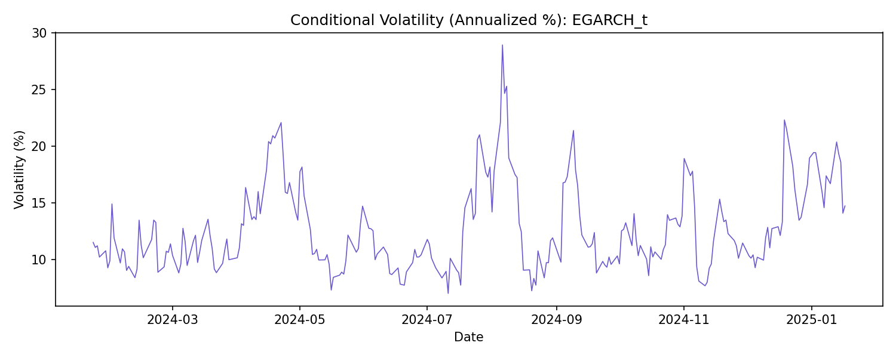
Annualized conditional volatility for the BIC-best variant. This is a sanity check on the shape and regime changes of the fitted volatility process.
- Persistent elevation indicates long-memory volatility rather than a quick reversion.
- Sudden jumps reflect shock absorption in the variance process.
- Gradual decay reflects how fast the model expects shocks to fade.

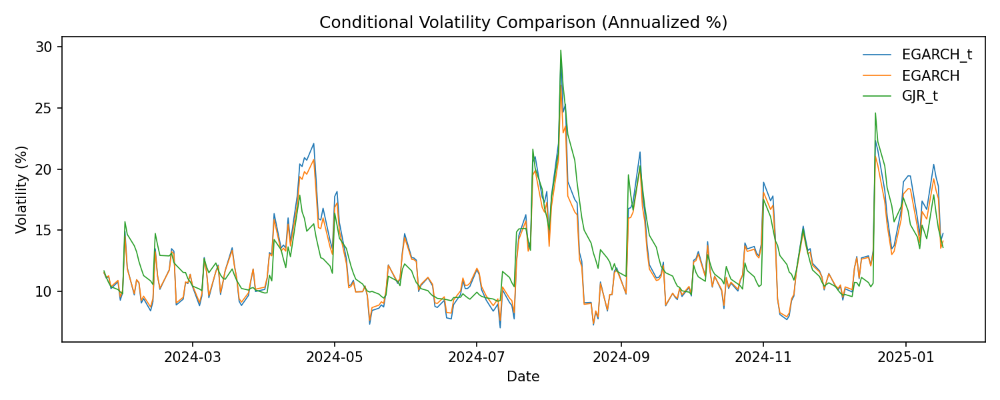
Side-by-side annualized conditional volatility for the top variants (by BIC). Look for stability and how fast each model reacts to shocks.
- Divergence across lines signals model sensitivity to shocks and asymmetry.
- The tightest clustering indicates robust behavior across variants.
- Large gaps imply specification differences that matter for regime labeling.

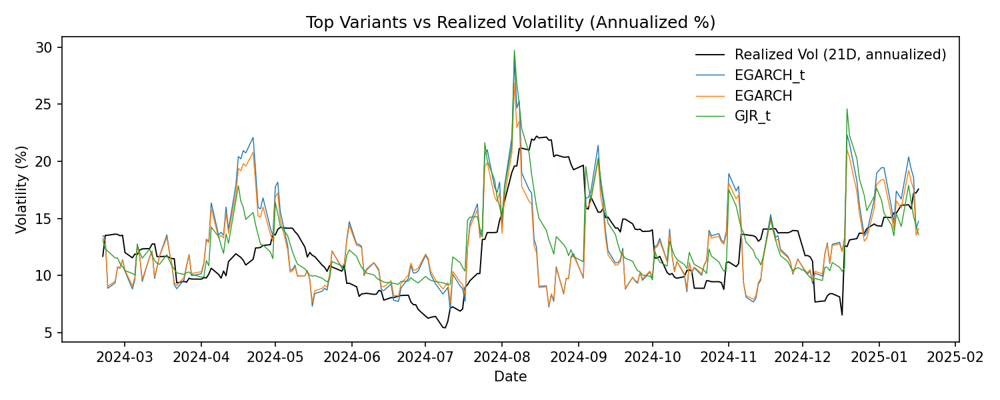
Compares top variants against realized 21D volatility. Visual agreement suggests better tracking of market risk.
- A variant that hugs realized volatility indicates better tracking, not necessarily better forecasting.
- Lagging patterns imply the model reacts after realized risk already moved.
- Overreaction shows excessive variance response to short-lived shocks.

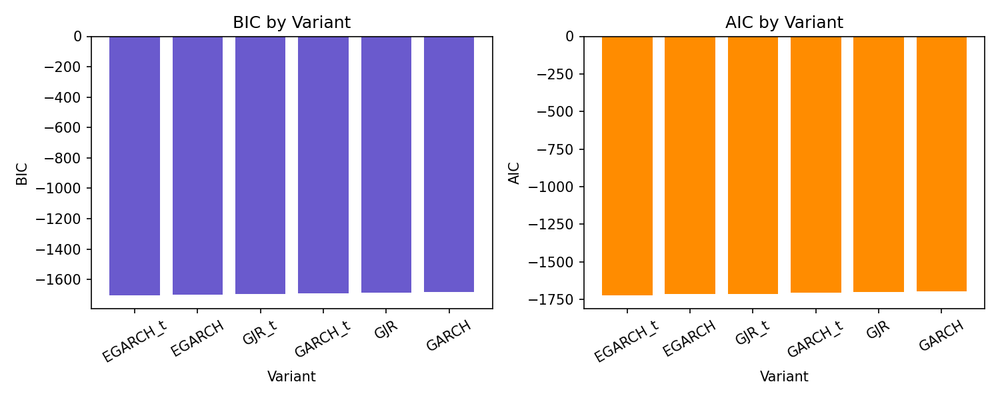
BIC and AIC scores by variant. Lower is better; these are in-sample fit metrics.
- BIC penalizes complexity more than AIC, favoring parsimonious fits.
- Large gaps indicate a clear winner; tight gaps imply model uncertainty.
- Use this as a fit screen, not a forecasting guarantee.

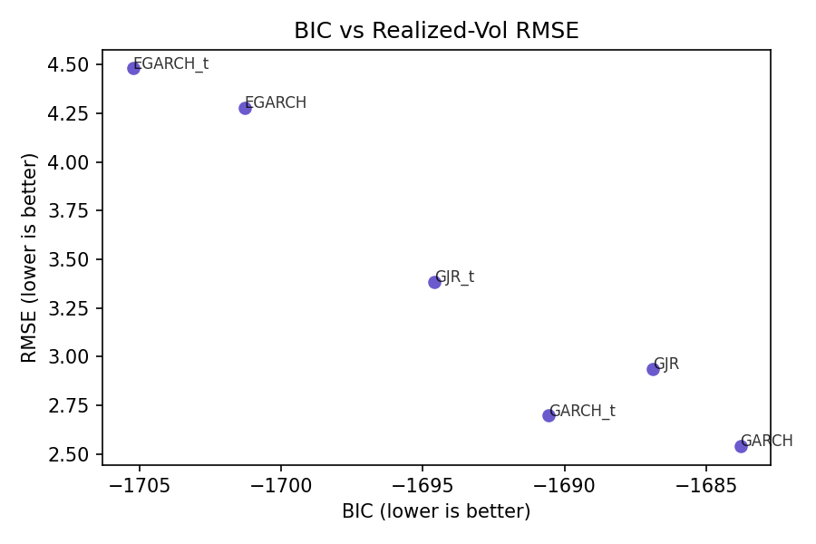
Trade-off between statistical fit (BIC) and realized-vol tracking (RMSE). Lower left is ideal.
- Points in the lower-left indicate both good fit and good tracking.
- Upper-left suggests good fit but weak realized-vol alignment.
- Lower-right implies better tracking at the cost of fit complexity.

## Validation (training window)

Standardized residual diagnostics for the chosen ARMA+GARCH fit.

Standardized residuals over time. Residuals should look like mean-zero noise with no obvious clustering.
- Visible clustering suggests remaining volatility structure not captured by GARCH.
- Large outliers indicate tail risk not explained by the chosen distribution.
- Stable variance implies the model absorbed most conditional heteroskedasticity.

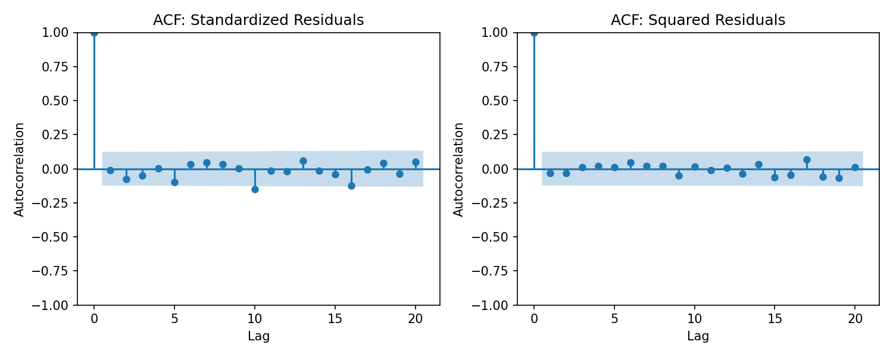
ACF of residuals and squared residuals. Remaining structure suggests model misspecification.
- Residual autocorrelation implies remaining mean dynamics.
- Squared-residual autocorrelation implies remaining variance dynamics.
- Flat lines support adequacy of the ARMA+GARCH fit.

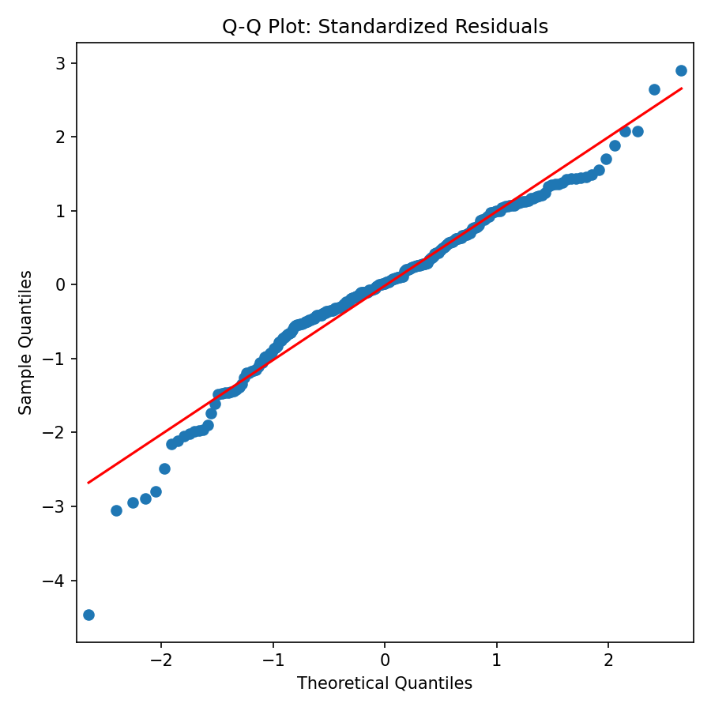
Q-Q plot versus a normal distribution. Deviations indicate non-normal tails.
- Curved tails imply heavier tails than normal.
- Symmetric deviations suggest fat tails rather than skew.
- Close alignment indicates distributional assumptions are reasonable.

## out of sample forecast performance (evaluation window)

Static and rolling forecasts versus realized volatility during the last-year out of sample window. The April 10-16 cluster in the context section aligns with the rolling-forecast spike window.

Static out of sample forecast from the training fit compared to realized volatility. Useful as a baseline but it lags the April 2025 policy-shock reversal sequence.
Realized volatility here is 21D annualized from returns. The static forecast is a single model fit from the pre-shock training window, so it is smoother and slower to react by design. Large gaps between the two lines signal regime changes or model under-reaction, which is exactly what the April shock reveals.
- The realized line rising ahead of the static line indicates the shock arrived before the model could adapt.
- Persistent gaps imply structural change in volatility rather than a one-off spike.
- Convergence later in the year suggests the model's long-run variance caught up as the shock decayed.
Event chronology (source: user-provided context above):
- 2025-04-10: Rapid reversal after tariff-pause headlines; CPI softer, but tariff-inflation risk dominated.
- 2025-04-11: Fed talk emphasized tariff-driven inflation risk; PPI day kept tension elevated.
- 2025-04-14: Electronics exemptions sparked a relief bid, but policy uncertainty remained.
- 2025-04-16: Retail sales surged on pull-forward demand; Fed tradeoff language sharpened.
- 2025-05-02: Jobs report showed slowing but resilient payrolls, stabilizing risk.

Rolling 1-step forecasts refit through time. This is the key out of sample signal used downstream for regimes and it captures the April 10-16 policy-driven volatility burst.
This series is re-estimated as new data arrives, so it should track realized volatility faster than the static line. When rolling forecasts overshoot realized, the model is treating shocks as persistent; when they undershoot, it is treating them as transitory. The April cluster shows a fast jump in conditional variance that aligns with the policy-shock regime.
- Spikes that lead realized volatility indicate the model is front-loading risk in response to new shocks.
- Overshoot followed by quick normalization suggests the shock was priced as temporary.
- Sustained elevation indicates a regime shift rather than a brief headline move.
Event chronology (source: user-provided context above):
- 2025-04-10: Post-pause sharp reversal lower lifted forward-looking variance.
- 2025-04-11: Tariff-driven inflation repricing kept conditional vol elevated.
- 2025-04-14: Electronics exemptions produced a relief rally without resolving uncertainty.
- 2025-04-15: Temporary calm still carried asymmetric tail risk.
- 2025-04-16: Retail-sales surge reinforced two-sided tail risk.

## Regime analysis (evaluation window)

Regimes are assigned from rolling out of sample conditional volatility, then compared to realized volatility and VIX behavior. Note the high-volatility regime clustering around April 4-21 in the context notes.

Points are colored by volatility regime (low/mid/high). Clustering indicates persistent regime states; April 2025 shows a dense high-vol cluster around tariff shock headlines.
Regimes are assigned by quantiles of conditional volatility (low/mid/high). Dense clusters reflect persistence, while frequent color changes indicate rapid regime switching. The April shock window exhibits a sustained high-vol regime rather than isolated spikes.
- Tight bands of red points imply a stable high-volatility regime.
- Scattered colors imply choppy transitions that are hard to trade.
- The post-April shift back to mid/low shows mean reversion in volatility.
Event chronology (source: user-provided context above):
- 2025-04-04 to 2025-04-08: Tariff shock and escalation drove risk-off positioning.
- 2025-04-10 to 2025-04-16: Rapid back-and-forth reversals kept the regime high-vol.
- 2025-04-21: Fed-independence concerns renewed drawdown pressure.
- 2025-04-24 to 2025-04-29: Rebound attempts amid tariff-uncertainty kept volatility elevated.

VIX level versus realized volatility (window selected by correlation). This highlights when implied risk diverges from realized risk during the April 2025 policy-shock period.
The realized series here uses the selected 10-day window, chosen for best correlation to VIX. When VIX sits above realized, the market is paying an insurance premium; when it is below, implied risk may be underpricing realized volatility. The tariff shock period shows wider gaps that reflect heightened risk premia.
- Widening gaps often align with hedging demand spikes.
- Convergence later indicates implied risk cooled as realized volatility normalized.
- Short-lived crossovers mark periods where realized volatility caught up to fear pricing.
Event chronology (source: user-provided context above):
- 2025-04-10 to 2025-04-11: Tariff-inflation fears lifted implied risk premium.
- 2025-04-14 to 2025-04-16: Exemptions and retail-sales surprises created implied/realized gaps.
- 2025-04-21: Fed-independence concerns widened risk premia again.

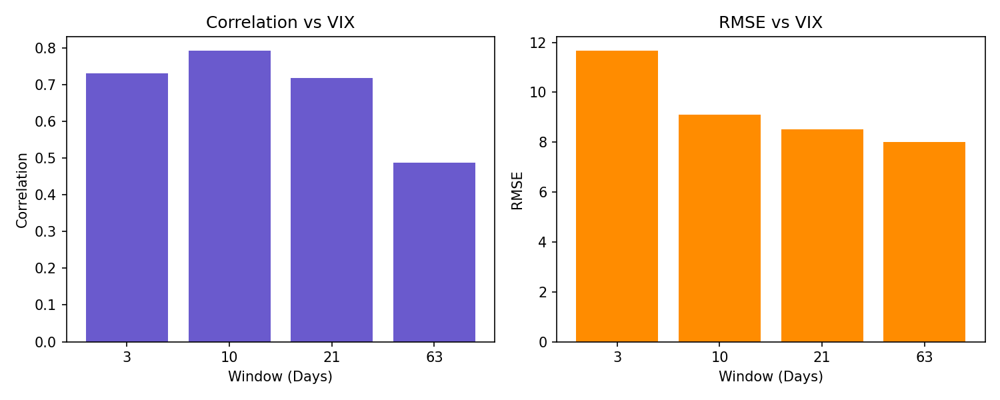
Correlation and RMSE by realized-vol window. The selected window maximizes correlation to VIX in-sample.
- Higher correlation implies tighter alignment between implied and realized risk.
- Lower RMSE indicates better level matching, not just co-movement.
- The chosen window is a compromise between responsiveness and noise.

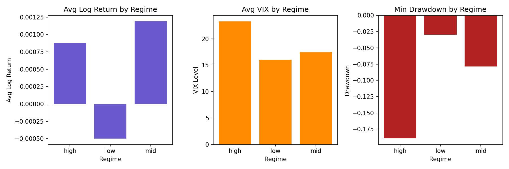
Average returns, VIX, and drawdowns by regime. This is the basis for regime-aware exposure decisions.
- High-vol regimes show higher VIX and deeper drawdowns, motivating de-risking.
- Low-vol regimes show lower drawdown risk but lower hedging urgency.
- Differences across regimes justify exposure mapping choices.

## Strategy backtest (evaluation window)

Equity curves and regime exposure overlays for the out of sample period. Drawdown lows line up with the April 4-10 tariff shock and the April 21 Fed-independence selloff.

Strategy equity versus buy-and-hold. Divergence indicates whether regime shifts improved risk-adjusted returns during the April 2025 shock and rebound.
- Periods of relative outperformance typically coincide with higher-volatility regimes when exposure is reduced.
- Underperformance in calmer stretches reflects the opportunity cost of de-risking.
- Drawdown differences show how exposure mapping moderates peak-to-trough risk.

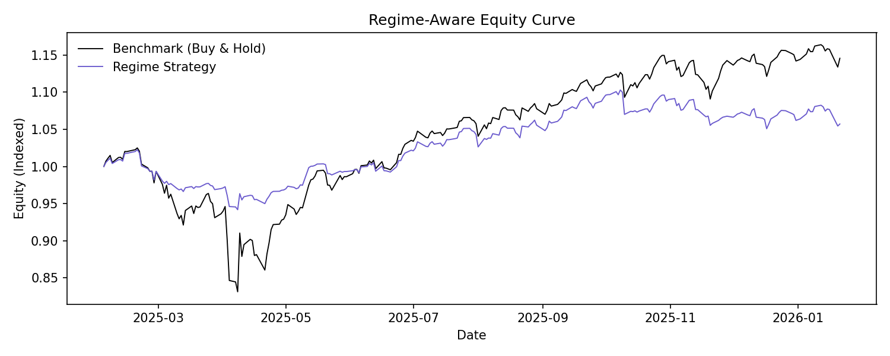
Same equity curve, re-based for a clean comparison within the out of sample year.
- The gap between lines measures the net effect of regime timing inside a single year.
- Abrupt divergences around April reveal how quickly the strategy reduced exposure.
- Gradual convergence afterward suggests diminished regime signal edge.

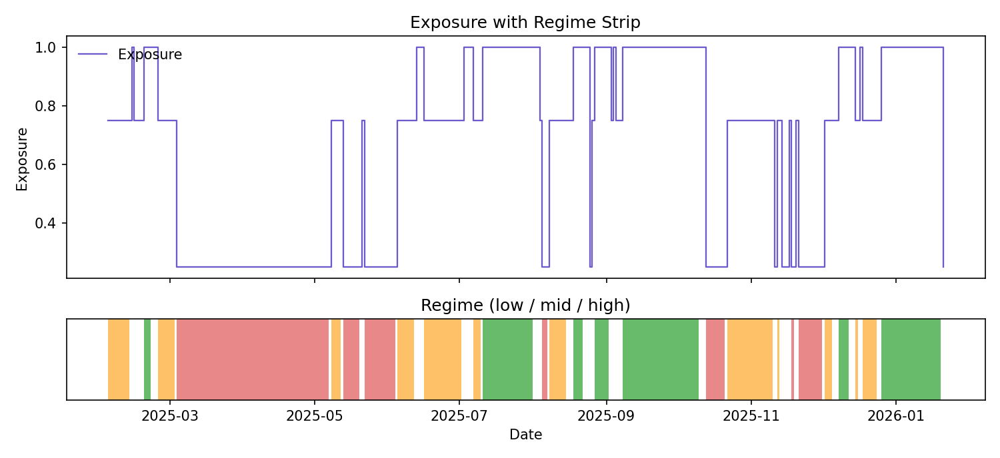
Exposure over time with regime strip. This shows how the regime signals translate into portfolio risk through the April 2025 headline-driven volatility cluster.
The step line is the portfolio exposure mapping (low/mid/high regimes to weights). The regime strip shows regime persistence and transition timing. Sharp exposure cuts during April indicate the strategy de-risking in response to the high-vol regime.
- Long stretches at reduced exposure imply the model viewed volatility as persistently elevated.
- Rapid up/down steps indicate regime instability and higher sharp reversal risk.
- Alignment between exposure cuts and drawdowns suggests risk control worked as intended.
Event chronology (source: user-provided context above):
- 2025-04-04: Tariff-shock liquidation phase.
- 2025-04-07: Continued escalation/retaliation risk.
- 2025-04-08: 104% China-linked tariff escalation.
- 2025-04-10: Violent reversal after tariff-pause rally.
- 2025-04-21: Fed-independence concerns added a second shock.

Zoomed last-year overlay for closer inspection of signal timing.
This zoom emphasizes whether exposure reductions lead or lag drawdowns. Use it to assess whether the regime signal is reactive (cuts after drawdown starts) or anticipatory (cuts before the worst of the move).
- Exposure cuts preceding the April drawdown indicate early warning from volatility estimates.
- Re-adding exposure too early can show up as second-leg drawdown risk.
- The April 21 shock highlights how quickly the model re-risked after the initial panic.
Event chronology (source: user-provided context above):
- 2025-04-04 to 2025-04-10: Tariff-shock drawdown cluster.
- 2025-04-21: Fed-independence shock.

## Hedge monitoring (evaluation window)

Hedge ratio signals and VIX versus realized volatility for the out of sample period. April 2025's tariff-driven volatility shows up as sharp moves in hedge cost ratios.

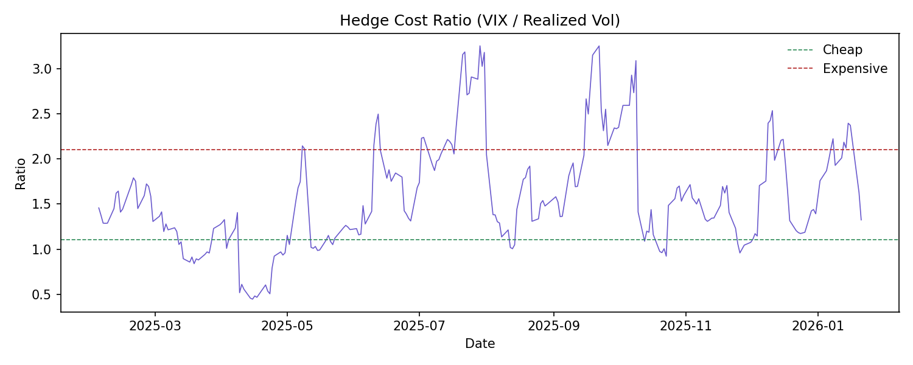
Hedge cost ratio (VIX/realized). Bands show cheap vs expensive hedge regimes, with April 2025 policy shocks widening the hedge premium.
The ratio compares implied volatility (VIX) to realized volatility, and the dashed bands mark the 20th/80th percentile thresholds. Spikes above the upper band indicate unusually expensive hedging, often during policy shocks. Drops toward the lower band indicate cheaper protection.
- Sustained readings above the top band show persistent fear premium.
- Quick mean reversion suggests short-lived panic rather than a durable stress regime.
- The width of swings reflects uncertainty about macro outcomes.
Event chronology (source: user-provided context above):
- 2025-04-10 to 2025-04-11: Tariff-driven inflation fear pushed hedge costs higher.
- 2025-04-14 to 2025-04-16: Policy exemptions and demand surprises kept hedging expensive.
- 2025-04-21: Fed-independence headlines re-widened hedge premia.

VIX and realized volatility together, showing hedge cost relative to observed market volatility.
This view shows the absolute levels behind the hedge ratio. Divergences indicate when implied risk moved faster than realized outcomes, which is typical during headline-driven shocks. Use it to confirm whether hedge cost spikes are driven by VIX jumps, realized spikes, or both.
- A VIX spike without a realized spike implies protection demand rather than realized turbulence.
- Parallel spikes suggest realized volatility is validating implied fears.
- A realized spike without VIX follow-through implies market complacency.
Event chronology (source: user-provided context above):
- 2025-04-10 to 2025-04-11: Implied vol repriced up faster than realized.
- 2025-04-24 to 2025-04-29: Rebound attempts kept implied vs realized gaps visible.
- 2025-05-02: Jobs report repriced both rates and equity risk expectations.

## Sources used for event notes

- Federal Reserve FOMC calendar: https://www.federalreserve.gov/monetarypolicy/fomccalendars.htm
- Google News RSS queries (primarily Reuters): https://news.google.com/rss/search?q=April%202025%20tariffs%20markets%20Reuters
