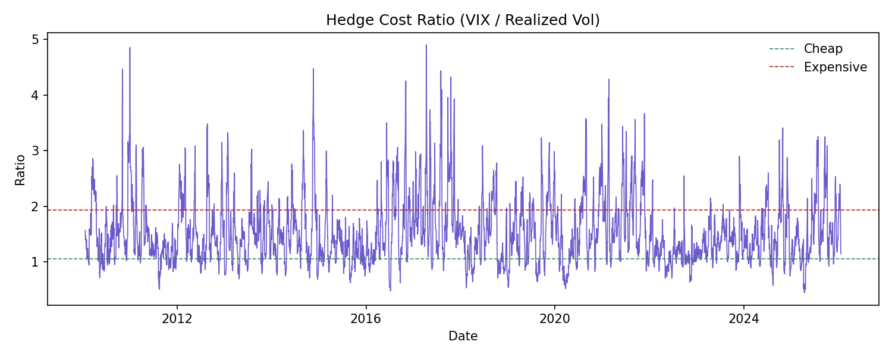

# Hedge Cost Monitoring

## Purpose

Track whether equity hedging is expensive or cheap by comparing VIX (implied volatility) to realized volatility.

## Outputs

- `data/summary.txt` for thresholds and signal mix
- `data/hedge_monitoring.csv` for the full time series
- `data/signal_mix.csv` for overall signal proportions
- `data/signal_by_regime.csv` for signal proportions by regime
- `data/signal_persistence.csv` for average signal durations
- `plots/hedge_ratio.png` for the hedge cost ratio
- `plots/vix_vs_realized.png` for VIX vs realized comparison

## Interpretation

- When VIX / realized volatility is high, hedging is expensive relative to recent realized risk.
- When the ratio is low, hedging is cheap relative to recent realized risk.
- Use the signal to guide hedge budgeting (allocate more when cheap, reduce or seek alternatives when expensive).

## Summary Table

Populated after running the pipeline (from `data/summary.txt`):

| Metric | Value |
| --- | --- |
| Ratio low threshold | 1.056 |
| Ratio high threshold | 1.925 |
| Cheap % | 20.00% |
| Neutral % | 59.99% |
| Expensive % | 20.00% |
| Avg cheap duration (days) | 4.6 |
| Avg neutral duration (days) | 7.8 |
| Avg expensive duration (days) | 5.9 |

## Figures

Plot notes:
- Spikes in the ratio mean hedging is expensive relative to recent realized risk.
- Dips below the cheap threshold flag windows where hedges are relatively inexpensive.
- Long stretches above the high threshold suggest persistent risk aversion or volatility risk premium.

Plot notes:
- VIX moving above realized vol indicates the market is pricing in higher future risk.
- If VIX stays below realized vol, hedging is priced cheaply but may be underestimating risk.
- Use this plot to validate that the ratio signal is not driven by data artifacts.
