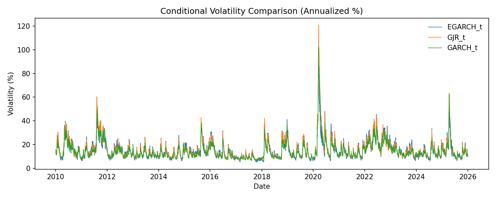
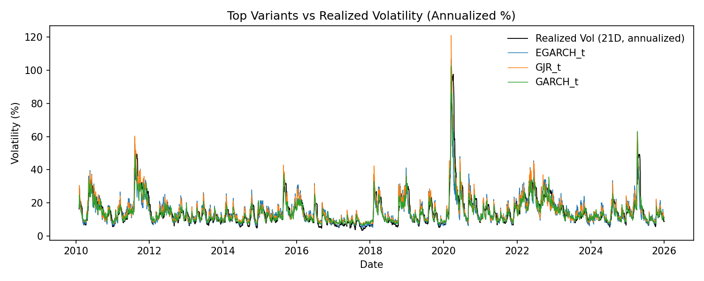
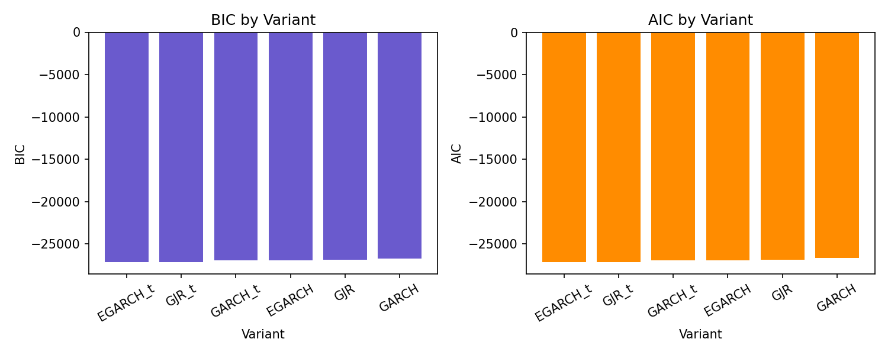
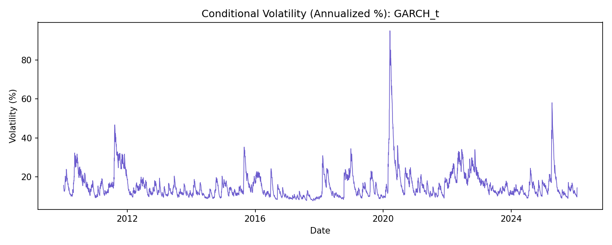
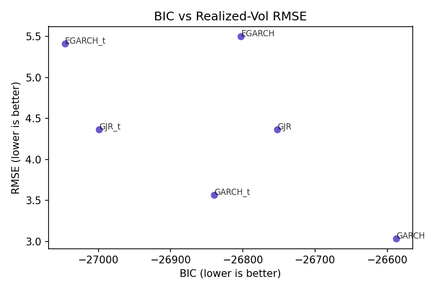

# Modeling Variants Summary

## Key Results

- Best variant by BIC: EGARCH_t
- Variants compared: GARCH, GJR, EGARCH with normal vs Student‑t errors
- Metrics: see `data/variant_metrics.csv` and `data/variant_realized_metrics.csv`

## Interpretation

- EGARCH_t suggests asymmetric volatility and heavy tails improve fit.
- Variant comparisons help validate model selection beyond the baseline GARCH.
- QLIKE (quasi-likelihood) evaluates volatility forecasts using realized variance; lower values are better and it is robust to measurement noise.
- Set `VARIANT_SELECTION = "tracking"` in `src/config.py` to select the variant with the best realized‑vol tracking metrics.
- AIC/BIC measure fit to returns and residual structure, not alignment to a realized‑vol proxy; tracking metrics answer a different question (how well the model matches observed volatility levels).
- Decision rule: prefer BIC for in‑sample explanatory fit, prefer tracking metrics when the goal is risk monitoring or hedge‑cost alignment.

## Variant Metrics (vs Realized Volatility)

| Variant | Corr | RMSE | QLIKE |
| --- | --- | --- | --- |
| GARCH | 0.9587 | 3.0347 | 6.1994 |
| GARCH_t | 0.9297 | 3.5652 | 6.2014 |
| GJR | 0.8901 | 4.3646 | 6.2286 |
| GJR_t | 0.8901 | 4.3646 | 6.2286 |
| EGARCH_t | 0.8173 | 5.4161 | 6.2747 |
| EGARCH | 0.8081 | 5.5010 | 6.2790 |

Note: BIC favors EGARCH_t for in-sample fit, while RMSE/QLIKE favor GARCH for realized-vol tracking. Use this to decide between fit quality and tracking accuracy.

## Figures

The comparison chart overlays the top variants (by BIC) so you can see whether they move together or diverge during stress.

This chart compares each top variant to annualized realized volatility so you can see which model best tracks actual volatility levels.

These bar charts show model selection criteria; more negative AIC/BIC values are better, and only relative differences matter.

This plot shows the preferred model’s conditional volatility path in annualized percent terms.

This scatter compares in-sample fit (BIC) to realized-vol tracking (RMSE) so you can see the tradeoff directly.

