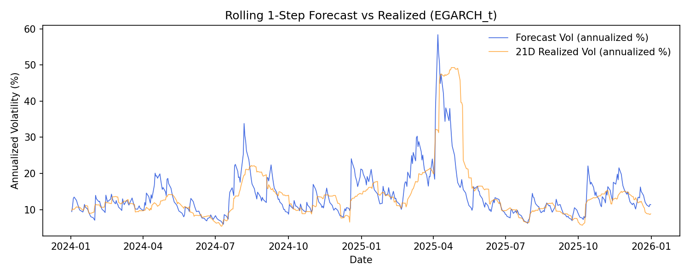

# Out-of-Sample Check Summary

## Key Results

- Split date: 2024-01-01
- Training rows: 3,521
- Test rows: 502
- ARMA order: (2, 0)
- Static multi-step forecast: available for GARCH; rolling 1-step remains the primary diagnostic

## What The Graph Shows

- `plots/forecast_vs_realized.png` uses a single multi-step forecast from the last in-sample point (only available for models that support analytic multi-step forecasts).
- `plots/forecast_vs_realized_rolling.png` uses rolling 1-step forecasts (refit each day).
- The orange line is 21-day realized volatility (annualized) computed from returns in the same window.
- `data/oos_metrics.csv` reports RMSE and correlation for static vs rolling forecasts.

## Interpretation

- Use the rolling forecast plot for the most realistic comparison; it should react to realized volatility changes.
- The static forecast plot is smoother and is only a coarse sanity check.
- Smoothness in the static line is expected because it is a single multi‑step forecast, not updated day‑by‑day.
- The main question is directional tracking: does forecasted volatility rise and fall with realized volatility?
- Large, persistent gaps can indicate model misspecification or scaling issues.
- Current metrics (from `data/oos_metrics.csv`): rolling corr 0.9193 with RMSE 3.2394; static corr 0.1696 with RMSE 8.2674.
- For risk monitoring, a moderate correlation with reasonable RMSE is acceptable; for trading or precise hedging, you would require materially tighter tracking.

## Figures

This plot shows the rolling 1-step forecast vs realized volatility for the selected variant.

