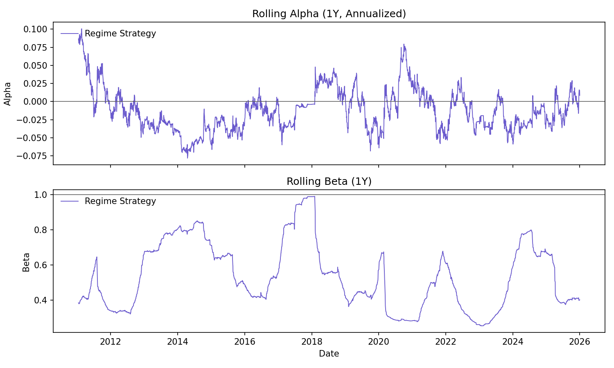

# Regime Strategy Backtest

## Purpose

Evaluate a simple regime-aware equity exposure rule: higher exposure in low volatility regimes and lower exposure in high volatility regimes.

## Key Figures (Last 12 Months)

These two plots are the most important visuals for understanding the regime overlay in practice. They zoom into the most recent 12 months and rebase both equity lines to the same start point, so you can see relative performance and risk‑scaling behavior clearly.

The strategy uses the regime labels generated from the selected ARMA‑GARCH variant (see `reports/modeling/README.md` and `reports/modeling_variants/README.md`). Exposure levels are the mapping defined by the backtest (default low=1.0, mid=0.75, high=0.25), which represent the fraction of equity exposure in each regime.

**Use cases:**
- Compare short‑horizon risk control vs buy‑and‑hold under current market conditions.
- Validate that exposure steps down during high‑volatility regimes and back up in low‑volatility regimes.
- Communicate how the regime signal translates into concrete position sizing.

**Color and scale guide:**
- Black line: buy‑and‑hold equity curve (rebased for last‑year view).
- Slate‑blue line: regime strategy equity curve (rebased for last‑year view).
- Regime strip colors: green = low, amber = mid, red = high volatility.
- Exposure values (e.g., 1.0, 0.75, 0.25) are the fraction of full equity exposure.

**Plot notes (last 12 months):**
- Equity curve: the regime strategy line should dip less during the drawdown window, showing risk scaling in action.
- Equity curve: if the regime line lags strongly during a sustained rally, the exposure map may be too defensive.
- Exposure overlay: exposure steps down sharply when the regime strip turns red (high vol) and rises in green (low vol).
- Exposure overlay: frequent flips between colors indicate noisy regimes; confirm they align with volatility spikes.

## Outputs

- `data/summary.txt` for return/vol/sharpe/drawdown
- `data/strategy_equity.csv` for equity curve and drawdowns
- `data/regime_performance.csv` for regime-level performance
- `data/exposure_stats.csv` for exposure distribution
- `data/strategy_variants.csv` for Sharpe-optimized exposure comparisons
- `plots/equity_curve.png` for the strategy vs benchmark chart
- `plots/exposure_overlay.png` for exposure levels with regime shading
- `plots/equity_curve_last_year.png` for the last-year equity curve zoom
- `plots/exposure_overlay_last_year.png` for the last-year exposure/regime zoom
- `plots/rolling_alpha_beta.png` for rolling 1Y alpha/beta vs benchmark

## Interpretation

- The equity curve compares the regime strategy to buy‑and‑hold; focus on drawdown depth and recovery speed, not just end value.
- This strategy underperforms buy‑and‑hold on raw return but improves drawdown and volatility, so it is a risk‑control tool.
- Use `data/strategy_variants.csv` to see whether alternative exposure maps improve Sharpe without materially hurting returns.
- If the objective is return maximization, buy‑and‑hold is the correct benchmark; if the objective is capital preservation and smoother risk, the regime overlay is the better fit.
- Alpha/Beta metrics in `data/summary.txt` show how much of the return is explained by market exposure.

## Alpha/Beta Interpretation

From `reports/strategy_backtest/data/summary.txt`:

- Alpha (annual): 0.0119
- Beta: 0.4195

Interpretation:
- Alpha is slightly positive but small, consistent with a risk-control overlay.
- Beta below 0.5 confirms the strategy runs materially less market exposure.
- Rolling alpha/beta in `plots/rolling_alpha_beta.png` shows alpha hovering near
  zero with occasional spikes; beta rises toward 1.0 in extended low-vol regimes.

### `plots/rolling_alpha_beta.png`

Plot notes:
- Rolling alpha spends much of the sample near zero and dips negative during
  persistent bull markets, reflecting opportunity cost of reduced exposure.
- Alpha spikes briefly around major volatility events, suggesting the overlay
  adds value primarily during stress windows.
- Rolling beta rises in low-volatility regimes (exposure increases), then falls
  sharply during high-volatility regimes (exposure throttles down).
- Beta rarely reaches 1.0, confirming the strategy stays structurally under-
  exposed relative to the benchmark.

## Summary Table

Populated after running the pipeline (from `data/summary.txt`):

| Metric | Value |
| --- | --- |
| Strategy annual return | 0.0618 |
| Strategy annual vol | 0.0872 |
| Strategy Sharpe | 0.7085 |
| Strategy max drawdown | -0.1234 |
| Buy-and-hold annual return | 0.1128 |
| Buy-and-hold annual vol | 0.1738 |
| Buy-and-hold Sharpe | 0.6486 |
| Buy-and-hold max drawdown | -0.3392 |
| Excess return vs buy-and-hold | -0.0510 |
| Best Sharpe exposure map | low=1.0, mid=1.0, high=0.5 |
| Best Sharpe | 0.7397 |

## Figures (Full Sample)

The full‑sample equity curve shows whether the strategy reduces drawdowns and volatility relative to buy‑and‑hold over the entire history.

The full‑sample exposure overlay highlights how the regime labels drive risk scaling over time: exposure rises in low‑volatility regimes and falls in high‑volatility regimes.

**Plot notes (full sample):**
- Equity curve: the regime strategy should show shallower drawdowns but lower terminal value than buy‑and‑hold.
- Exposure overlay: long red blocks (high vol) should correspond to reduced exposure plateaus.
- Exposure overlay: extended green periods should map to higher exposure and faster compounding.
- Equity curve: if the regime line diverges sharply only during a single period, investigate regime stability.
