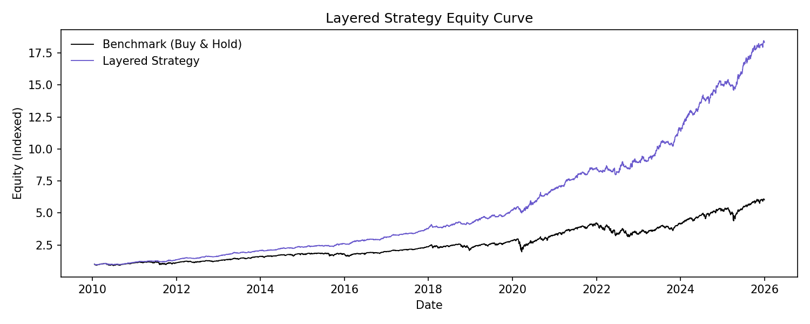
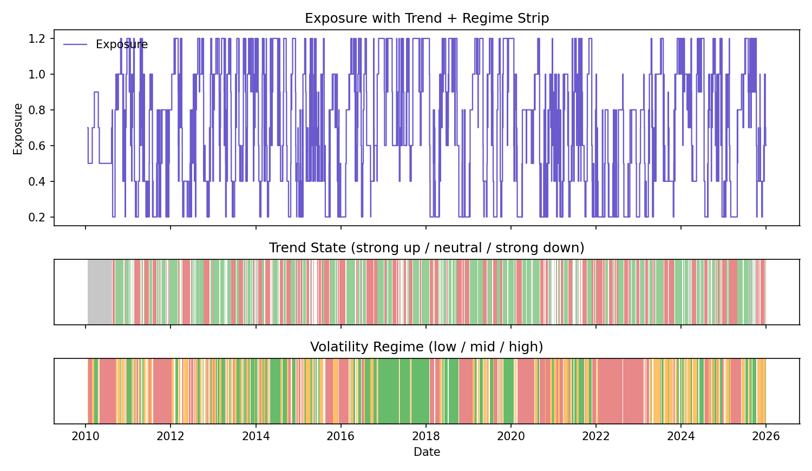

# Layered Strategy Backtest (Full Writeup)

## Executive Summary

This layered strategy combines volatility regimes with a fast trend signal to
target higher returns than buy-and-hold while still controlling drawdown. The
current sweep winner uses a 21-day trend window and an aggressive exposure map.
It materially outperforms both the benchmark and the regime-only strategy in
this sample.

## Objective

Beat S&P 500 buy-and-hold on total return while keeping drawdown no worse than
the benchmark. Volatility regimes act as a risk governor, and the trend layer
acts as the return engine.

## Strategy Design (Deep Dive)

### Layer 1: Volatility Regime (Risk Governor)

- Input: ARMA-GARCH conditional volatility.
- Regimes: low / mid / high based on 33% and 66% quantiles.
- Purpose: cap exposure when volatility regimes indicate stress.

### Layer 2: Trend State (Return Engine)

- Input: SPX adjusted close.
- Trend score: log-price change over the trend window.
- Normalization: convert to a z-score using a rolling window.
- State bucketing:
  - strong_up: score >= +0.15
  - neutral: -0.15 < score < +0.15
  - strong_down: score <= -0.15

### Exposure Matrix (How the Layers Combine)

Exposure is determined by (regime x trend state):

- low regime: strong_up 1.2, neutral 0.9, strong_down 0.6
- mid regime: strong_up 1.0, neutral 0.7, strong_down 0.4
- high regime: strong_up 0.8, neutral 0.5, strong_down 0.2

Interpretation:
- Trend decides the direction and intensity.
- Regime throttles risk when volatility is elevated.
- Max exposure can exceed 1.0 to capture upside in strong uptrends.

### Rebalance Cadence

- Daily rebalancing for responsiveness.
- This increases turnover, so cost sensitivity matters.

## Selected Configuration (Sweep Winner)

Best holdout candidate (from `reports/strategy_layered_sweep/analysis/summary.txt`):

- trend_window: 21
- trend_z_window: 126
- trend_threshold: 0.15
- state_confirm: 1
- rebalance: daily
- exposure matrix: aggressive (listed above)

Holdout metrics:
- holdout_excess_return: +0.0682
- holdout_drawdown_gap: +0.2489
- holdout_sharpe: 2.0853

## Outputs

- `data/summary.txt` for gross/net performance, turnover, and parameters
- `data/layered_strategy_equity.csv` for equity curves, turnover, and drawdowns
- `data/state_performance.csv` for regime x trend performance
- `data/exposure_stats.csv` for exposure distribution
- `data/turnover_stats.csv` for turnover distribution stats
- `data/cost_sensitivity.csv` for net performance vs cost assumptions
- `plots/equity_curve.png` for gross strategy vs benchmark
- `plots/equity_curve_net.png` for net (cost-adjusted) strategy vs benchmark
- `plots/equity_curve_last_year.png` for last-year gross zoom
- `plots/equity_curve_net_last_year.png` for last-year net zoom
- `plots/equity_curve_compare.png` for benchmark vs regime-only vs layered
- `plots/equity_curve_compare_last_year.png` for last-year comparison
- `plots/exposure_overlay.png` for exposure with trend + regime strips
- `plots/exposure_overlay_last_year.png` for last-year exposure zoom
- `plots/rolling_cagr.png` for rolling CAGR (1Y and 3Y)
- `plots/rolling_drawdown.png` for rolling max drawdown (1Y and 3Y)
- `plots/turnover_hist.png` for turnover distribution
- `plots/cost_sensitivity.png` for net return and Sharpe vs cost assumptions

## Turnover and Cost Sensitivity

Transaction costs are modeled as a fixed cost per unit of turnover. Turnover is
the absolute change in exposure from one period to the next:

`turnover_t = |exposure_t - exposure_{t-1}|`

Cost rate per period:

`cost_rate_t = turnover_t * (cost_bps / 10000)`

Net log return is approximated as:

`strategy_log_return_net = strategy_log_return - cost_rate`

Where to see this:
- `data/summary.txt` includes gross vs net performance and cost drag.
- `data/layered_strategy_equity.csv` includes `turnover`, `cost_rate`,
  `strategy_equity_net`, and `drawdown_net`.

Scale effects:
- Linear trading costs (commissions/slippage in bps) scale with turnover, not
  with portfolio size, so % performance impact is similar across sizes.
- Market impact is nonlinear at large sizes; cost per bps rises as trade size
  increases, so large portfolios will experience higher effective costs.

## Performance Comparison (Full Sample)

Source: `reports/strategy_layered/data/summary.txt` and
`reports/strategy_backtest/data/summary.txt`.

| Strategy | Annual return | Annual vol | Sharpe | Max drawdown | Excess return vs benchmark |
| --- | --- | --- | --- | --- | --- |
| Layered strategy | 0.1825 | 0.0951 | 1.9205 | -0.0903 | +0.0698 |
| Regime-only strategy | 0.0618 | 0.0872 | 0.7085 | -0.1234 | -0.0510 |
| Buy-and-hold | 0.1128 | 0.1738 | 0.6486 | -0.3392 | 0.0000 |

Layered vs regime-only deltas:
- Return: +0.1207
- Volatility: +0.0079
- Sharpe: +1.2120
- Max drawdown improves from -0.1234 to -0.0903

## Graph Comparisons (Regime-Only vs Layered)

### Equity Curve (Full Sample)

Files:
- Regime-only: `reports/strategy_backtest/plots/equity_curve.png`
- Layered: `reports/strategy_layered/plots/equity_curve.png`

What changes:
- Regime-only equity stays well below the benchmark for most of the sample.
- Layered equity diverges upward and finishes far above the benchmark.
- The separation shows the trend layer adds return instead of only risk control.

### Equity Curve (Last Year)

Files:
- Regime-only: `reports/strategy_backtest/plots/equity_curve_last_year.png`
- Layered: `reports/strategy_layered/plots/equity_curve_last_year.png`

What changes:
- Regime-only remains below the benchmark after the drawdown.
- Layered recovers faster and ends above the benchmark.

### Exposure Overlay (Full Sample)

Files:
- Regime-only: `reports/strategy_backtest/plots/exposure_overlay.png`
- Layered: `reports/strategy_layered/plots/exposure_overlay.png`

What changes:
- Regime-only exposure steps only when regime changes; it cannot respond to
  directional shifts within the same volatility state.
- Layered exposure moves more frequently because trend can shift inside a regime.
- The trend strip adds a second decision axis that drives exposure changes.

### Exposure Overlay (Last Year)

Files:
- Regime-only: `reports/strategy_backtest/plots/exposure_overlay_last_year.png`
- Layered: `reports/strategy_layered/plots/exposure_overlay_last_year.png`

What changes:
- Regime-only stays in reduced exposure through a long high-vol regime stretch.
- Layered scales up when trend improves even if volatility is still elevated.
- This is a key reason for the higher return profile.

## How to Read the Layered Plots

### Equity Curve
- Look for persistent separation above the benchmark, not just short bursts.
- Check the drawdown depth and recovery time relative to buy-and-hold.

### Exposure Overlay
- Exposure should rise in strong uptrends and fall in strong downtrends.
- Regime bands should cap exposure during high volatility windows.
- If exposure oscillates too frequently, the trend threshold may be too low.

## State-Level Diagnostics

From `reports/strategy_layered/data/state_performance.csv`:

- Strong uptrend states show the highest average returns and exposures.
- Strong downtrend states are negative on average and carry the lowest exposure.
- High-vol + strong-down is the most defensive state (0.2 exposure).

## Exposure Distribution

From `reports/strategy_layered/data/exposure_stats.csv`:

- Mean exposure: 0.717
- Median exposure: 0.800
- Range: 0.200 to 1.200

This confirms the strategy is usually below full exposure but can exceed 1.0
in strong uptrends.

## Additional Graphs and Overlays to Consider

1) Rolling CAGR (1Y, 3Y) for layered vs benchmark vs regime-only
2) Rolling max drawdown (1Y, 3Y) to validate stability
3) Turnover and exposure-change histogram (daily vs weekly cost impact)
4) State contribution chart: return contribution by (regime, trend_state)
5) Trend-only vs layered vs regime-only equity curves
6) Regime transition heatmap and trend transition heatmap
7) Tail-risk plot: worst 20 daily returns vs benchmark
8) Cost sensitivity: add 5-10 bps per trade and replot equity curve

## Practical Next Steps

1) Add turnover and cost-adjusted equity curves.
2) Compare layered vs trend-only and layered vs regime-only in the same plot.
3) Test a slower trend window (42 or 63) to reduce noise.
4) Run a holdout-only backtest using the same parameters (no retuning).

## Figures (Layered Strategy)

