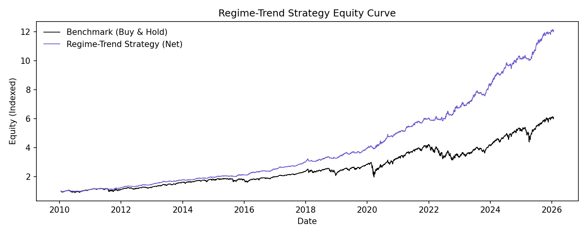
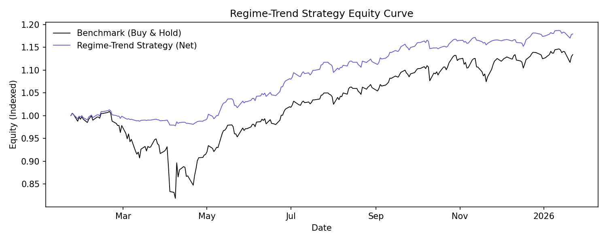
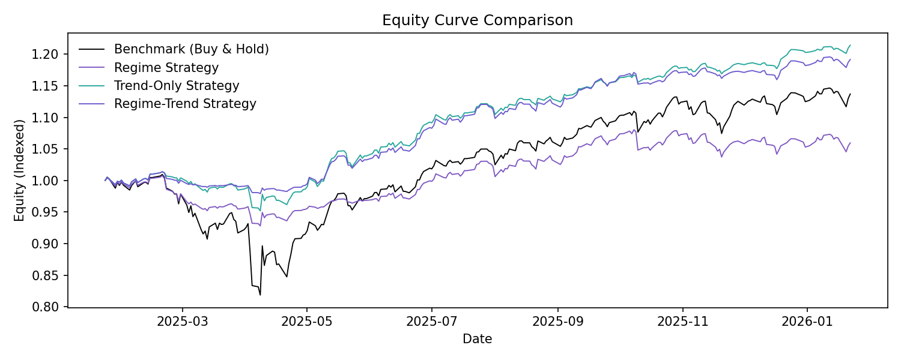

# Regime-Trend Strategy Backtest (Full Writeup)

## Executive Summary

This regime-trend strategy combines volatility regimes with a fast trend signal to
target higher returns than buy-and-hold while still controlling drawdown. The
current sweep winner uses a 21-day trend window and an aggressive exposure map.
It materially outperforms both the benchmark and the regime-only strategy in
this sample.

## Objective

Beat S&P 500 buy-and-hold on total return while keeping drawdown no worse than
the benchmark. Volatility regimes act as a risk governor, and the trend layer
acts as the return engine.

## Strategy Design (Deep Dive)

### Layer 1: Volatility Regime (Risk Governor)

- Input: ARMA-GARCH conditional volatility.
- Regimes: low / mid / high based on 33% and 66% quantiles.
- Purpose: cap exposure when volatility regimes indicate stress.

### Layer 2: Trend State (Return Engine)

- Input: SPX adjusted close.
- Trend score: log-price change over the trend window.
- Normalization: convert to a z-score using a rolling window.
- State bucketing:
  - strong_up: score >= +0.15
  - neutral: -0.15 < score < +0.15
  - strong_down: score <= -0.15

### Exposure Matrix (How the Layers Combine)

Exposure is determined by (regime x trend state):

- low regime: strong_up 1.2, neutral 0.9, strong_down 0.6
- mid regime: strong_up 1.0, neutral 0.7, strong_down 0.4
- high regime: strong_up 0.8, neutral 0.5, strong_down 0.2

Interpretation:
- Trend decides the direction and intensity.
- Regime throttles risk when volatility is elevated.
- Max exposure can exceed 1.0 to capture upside in strong uptrends.

### Rebalance Cadence

- Daily rebalancing for responsiveness.
- This increases turnover, so cost sensitivity matters.

## Selected Configuration (Sweep Winner)

Best holdout candidate (from `reports/strategy_regime_trend_sweep/data/summary.txt`):

- trend_window: 21
- trend_z_window: 126
- trend_threshold: 0.15
- state_confirm: 1
- rebalance: daily
- exposure matrix: aggressive (listed above)

Holdout metrics:
- holdout_excess_return: +0.0682
- holdout_drawdown_gap: +0.2489
- holdout_sharpe: 2.0853

## Outputs

- `data/summary.txt` for gross/net performance, turnover, and parameters
- `data/regime_trend_equity.csv` for equity curves, turnover, and drawdowns
- `data/state_performance.csv` for regime x trend performance
- `data/exposure_stats.csv` for exposure distribution
- `data/turnover_stats.csv` for turnover distribution stats
- `data/cost_sensitivity.csv` for net performance vs cost assumptions
- `data/regime_map_comparison.csv` for regime-only exposure map sensitivity
- `plots/equity_curve.png` for gross strategy vs benchmark
- `plots/equity_curve_net.png` for net (cost-adjusted) strategy vs benchmark
- `plots/equity_curve_last_year.png` for last-year gross zoom
- `plots/equity_curve_net_last_year.png` for last-year net zoom
- `plots/equity_curve_compare.png` for benchmark vs regime-only vs trend-only vs regime-trend
- `plots/equity_curve_compare_last_year.png` for last-year comparison
- `plots/exposure_overlay.png` for exposure with trend + regime strips
- `plots/exposure_overlay_last_year.png` for last-year exposure zoom
- `plots/rolling_cagr.png` for rolling CAGR (1Y and 3Y)
- `plots/rolling_drawdown.png` for rolling max drawdown (1Y and 3Y)
- `plots/rolling_alpha_beta.png` for rolling alpha/beta (1Y) vs benchmark
- `plots/turnover_hist.png` for turnover distribution
- `plots/cost_sensitivity.png` for net return and Sharpe vs cost assumptions

## Turnover and Cost Sensitivity

Transaction costs are modeled as a fixed cost per unit of turnover. Turnover is
the absolute change in exposure from one period to the next:

`turnover_t = |exposure_t - exposure_{t-1}|`

Cost rate per period:

`cost_rate_t = turnover_t * (cost_bps / 10000)`

Net log return is approximated as:

`strategy_log_return_net = strategy_log_return - cost_rate`

Where to see this:
- `data/summary.txt` includes gross vs net performance and cost drag.
- `data/regime_trend_equity.csv` includes `turnover`, `cost_rate`,
  `strategy_equity_net`, and `drawdown_net`.

Scale effects:
- Linear trading costs (commissions/slippage in bps) scale with turnover, not
  with portfolio size, so % performance impact is similar across sizes.
- Market impact is nonlinear at large sizes; cost per bps rises as trade size
  increases, so large portfolios will experience higher effective costs.

## Regime Exposure Map Sensitivity

`data/regime_map_comparison.csv` compares regime-only performance across
different exposure maps (default, sharpe_best, aggressive, defensive). This
helps isolate how much return can be gained from regime tuning alone, and
quantifies the incremental value of adding the trend layer.

Summary from the latest run:
- default: return 0.0618, vol 0.0872, Sharpe 0.7085, max DD -0.1234
- sharpe_best: return 0.0877, vol 0.1185, Sharpe 0.7397, max DD -0.2066
- aggressive: return 0.0899, vol 0.1258, Sharpe 0.7151, max DD -0.2087
- defensive: return 0.0358, vol 0.0673, Sharpe 0.5325, max DD -0.1095

## Performance Comparison (Full Sample)

Source: `reports/strategy_regime_trend/data/summary.txt` and
`reports/strategy_backtest/data/summary.txt`.

| Strategy | Annual return | Annual vol | Sharpe | Max drawdown | Excess return vs benchmark |
| --- | --- | --- | --- | --- | --- |
| Regime-Trend strategy | 0.1825 | 0.0951 | 1.9205 | -0.0903 | +0.0698 |
| Regime-Trend strategy (net, 5 bps) | 0.1726 | 0.0950 | 1.8168 | -0.0908 | +0.0599 |
| Trend-only strategy | 0.1908 | 0.1090 | 1.7503 | -0.1527 | +0.0780 |
| Regime-only strategy | 0.0618 | 0.0872 | 0.7085 | -0.1234 | -0.0510 |
| Buy-and-hold | 0.1128 | 0.1738 | 0.6486 | -0.3392 | 0.0000 |

Regime-Trend vs regime-only deltas:
- Return: +0.1207
- Volatility: +0.0079
- Sharpe: +1.2120
- Max drawdown improves from -0.1234 to -0.0903

## Graph Comparisons (Benchmark vs Regime-Only vs Trend-Only vs Regime-Trend)

### Equity Curve (Full Sample)

Files:
- Regime-only: `reports/strategy_backtest/plots/equity_curve.png`
- Regime-Trend: `reports/strategy_regime_trend/plots/equity_curve.png`

What changes:
- Regime-only equity stays well below the benchmark for most of the sample.
- Regime-Trend equity diverges upward and finishes far above the benchmark.
- The separation shows the trend layer adds return instead of only risk control.
- Trend-only sits between regime-only and regime-trend (see `plots/equity_curve_compare.png`).

### Equity Curve (Last Year)

Files:
- Regime-only: `reports/strategy_backtest/plots/equity_curve_last_year.png`
- Regime-Trend: `reports/strategy_regime_trend/plots/equity_curve_last_year.png`

What changes:
- Regime-only remains below the benchmark after the drawdown.
- Regime-Trend recovers faster and ends above the benchmark.
- Trend-only recovers faster than regime-only but lags regime-trend.

### Exposure Overlay (Full Sample)

Files:
- Regime-only: `reports/strategy_backtest/plots/exposure_overlay.png`
- Regime-Trend: `reports/strategy_regime_trend/plots/exposure_overlay.png`

What changes:
- Regime-only exposure steps only when regime changes; it cannot respond to
  directional shifts within the same volatility state.
- Regime-Trend exposure moves more frequently because trend can shift inside a regime.
- The trend strip adds a second decision axis that drives exposure changes.

### Exposure Overlay (Last Year)

Files:
- Regime-only: `reports/strategy_backtest/plots/exposure_overlay_last_year.png`
- Regime-Trend: `reports/strategy_regime_trend/plots/exposure_overlay_last_year.png`

What changes:
- Regime-only stays in reduced exposure through a long high-vol regime stretch.
- Regime-Trend scales up when trend improves even if volatility is still elevated.
- This is a key reason for the higher return profile.

## How to Read the Regime-Trend Plots

### Equity Curve
- Look for persistent separation above the benchmark, not just short bursts.
- Check the drawdown depth and recovery time relative to buy-and-hold.

### Exposure Overlay
- Exposure should rise in strong uptrends and fall in strong downtrends.
- Regime bands should cap exposure during high volatility windows.
- If exposure oscillates too frequently, the trend threshold may be too low.

## Alpha/Beta Summary (Full Sample)

From `reports/strategy_regime_trend/data/summary.txt`:

- Regime-Trend alpha (annual): 0.1290
- Regime-Trend beta: 0.4543
- Regime-Trend alpha (net, 5 bps): 0.1191
- Regime-Trend beta (net): 0.4544
- Regime-only alpha (annual): 0.0119
- Regime-only beta: 0.4195
- Trend-only alpha (annual): 0.1231
- Trend-only beta: 0.5763

Interpretation:
- Regime-Trend alpha is materially positive, suggesting returns are not just a
  leveraged beta bet.
- Beta stays below 0.5, indicating a lower market exposure profile.

## Plot Interpretations (Detailed)

### `plots/equity_curve_compare.png`
- The regime-trend line pulls away from both the benchmark and the regime-only
  strategy after 2016 and remains above them through the end of the sample.
- Regime-only remains below buy-and-hold most of the time, confirming it is a
  risk-control overlay, not a return engine.
- The long-run gap between regime-trend and benchmark indicates persistent
  outperformance, not a single short-lived burst.

### `plots/equity_curve_compare_last_year.png`
- In the 2025 shock window, buy-and-hold draws down sharply; regime-trend remains
  above benchmark and recovers faster.
- Regime-only stays below the benchmark after the drawdown, reflecting its
  conservative exposure settings.
- Regime-Trend maintains a higher terminal level, matching the sweep goal.

### `plots/rolling_cagr.png`
- 1Y rolling CAGR: regime-trend typically stays above benchmark and regime-only,
  with fewer deep negative swings during drawdowns (notably 2020 and 2022).
- 3Y rolling CAGR: regime-trend sits consistently above benchmark across most of the
  sample, while regime-only runs the lowest.
- The persistence of the 3Y advantage suggests the edge is not concentrated in
  a single year.

### `plots/rolling_drawdown.png`
- 1Y rolling max drawdown: benchmark reaches deep drawdowns (near -0.35 around
  2020), while regime-trend remains much shallower (generally around -0.05 to -0.12).
- 3Y rolling max drawdown: regime-trend consistently exhibits the smallest drawdowns,
  with regime-only in the middle and benchmark worst.
- This confirms the trend layer adds return without giving up drawdown control.

### `plots/rolling_alpha_beta.png`
- Rolling alpha for regime-trend is positive most of the time and peaks around 2020,
  indicating strong risk-adjusted outperformance during regime transitions.
- Regime-only alpha oscillates around zero and is often negative, consistent
  with its lower-return profile.
- Rolling beta for both strategies stays below 1.0; regime-trend generally sits
  around 0.4-0.7, with regime-only spiking toward 1.0 during low-vol stretches.

### `plots/cost_sensitivity.png`
- Net annual return declines roughly linearly as cost bps increase, indicating
  turnover is moderate and cost effects are predictable.
- At 5 bps, net annual return falls from 0.1825 to 0.1726 and Sharpe drops from
  1.9205 to 1.8168.
- At 10 bps, the strategy still maintains strong net returns, but the margin
  vs buy-and-hold narrows meaningfully.

### `plots/turnover_hist.png`
- Most days show near-zero turnover, implying exposure is often stable despite
  daily rebalancing.
- Distinct spikes around ~0.2-0.3 reflect step changes in the exposure matrix
  when trend or regime states flip.
- Occasional larger jumps (~0.6) reflect switching from high-exposure to
  defensive states.

## State-Level Diagnostics

From `reports/strategy_regime_trend/data/state_performance.csv`:

- Strong uptrend states show the highest average returns and exposures.
- Strong downtrend states are negative on average and carry the lowest exposure.
- High-vol + strong-down is the most defensive state (0.2 exposure).

## Exposure Distribution

From `reports/strategy_regime_trend/data/exposure_stats.csv`:

- Mean exposure: 0.717
- Median exposure: 0.800
- Range: 0.200 to 1.200

This confirms the strategy is usually below full exposure but can exceed 1.0
in strong uptrends.

## Alpha/Beta Context

Alpha and beta are computed using simple returns (not log returns):

- Alpha (annualized) = intercept of strategy excess returns vs benchmark.
- Beta = slope of strategy returns vs benchmark.

Rolling alpha/beta helps verify that outperformance is not isolated to a single
short window. See `plots/rolling_alpha_beta.png`.

## Additional Graphs and Overlays to Consider

1) Rolling CAGR (1Y, 3Y) for regime-trend vs benchmark vs regime-only
2) Rolling max drawdown (1Y, 3Y) to validate stability
3) Turnover and exposure-change histogram (daily vs weekly cost impact)
4) State contribution chart: return contribution by (regime, trend_state)
5) Trend-only vs regime-trend vs regime-only equity curves
6) Regime transition heatmap and trend transition heatmap
7) Tail-risk plot: worst 20 daily returns vs benchmark
8) Cost sensitivity: add 5-10 bps per trade and replot equity curve

## GBM Forward Test (Synthetic Paths)

For a forward-looking stress test using geometric Brownian motion, see:

- `reports/strategy_regime_trend_gbm/README.md`

This report includes 1Y/3Y/5Y simulated horizons with baselines, plus return,
drawdown, and alpha distributions.

## Practical Next Steps

1) Add turnover and cost-adjusted equity curves.
2) Compare regime-trend vs trend-only and regime-trend vs regime-only in the same plot.
3) Test a slower trend window (42 or 63) to reduce noise.
4) Run a holdout-only backtest using the same parameters (no retuning).

## Plot-by-Plot Interpretation (Detailed)

### `plots/equity_curve.png`

Plot notes:
- The regime-trend strategy compounds faster than buy-and-hold over the full sample.
- The gap between regime-trend and benchmark widens in 2020–2026, showing sustained edge.
- The curve is smoother (lower volatility) despite higher terminal value.

### `plots/equity_curve_net.png`

Plot notes:
- Net performance tracks the gross curve closely, showing modest cost drag.
- The terminal gap vs benchmark remains large even after costs.
- Use this to sanity-check whether the edge survives realistic transaction costs.

### `plots/equity_curve_last_year.png`

Plot notes:
- The regime-trend curve stays above the benchmark through the 2025 drawdown window.
- The recovery phase is faster than buy-and-hold, indicating trend re‑risking.
- This view isolates short‑term behavior and timing quality.

### `plots/equity_curve_net_last_year.png`

Plot notes:
- Net returns remain above the benchmark across most of the last year.
- The net curve stays close to gross, suggesting turnover is not extreme.
- If this curve were below benchmark, costs would be the first suspect.

### `plots/exposure_overlay.png`

Plot notes:
- Exposure responds to both trend shifts and regime changes, creating more frequent
  step changes than the regime-only strategy.
- Extended low-vol + strong-up windows show exposures near 1.0–1.2.
- High-vol + strong-down windows compress exposure toward the 0.2 floor.

### `plots/exposure_overlay_last_year.png`

Plot notes:
- Early‑year downtrend compresses exposure quickly, limiting drawdown depth.
- Mid‑year trend recovery lifts exposure even as regimes remain mixed.
- Late‑year exposure tapers with trend softening despite calmer regimes.

### `plots/equity_curve_compare.png`

Plot notes:
- Trend-only has the highest terminal equity, but also higher drawdown volatility.
- Regime-Trend finishes below trend-only but well above benchmark, indicating risk‑adjusted balance.
- Regime-only stays below benchmark, confirming it is mainly a risk‑control overlay.
- The regime-trend edge compounds steadily rather than appearing as a one‑off spike.

### `plots/equity_curve_compare_last_year.png`

Plot notes:
- Trend-only ends highest, regime-trend stays close behind, benchmark below both.
- Regime-Trend drawdown is shallower than trend-only during the shock window.
- Regime-only remains below benchmark after the drawdown, reflecting conservative exposure.
- The comparison highlights the tradeoff: trend-only maximizes return, regime-trend smooths risk.

### `plots/rolling_cagr.png`

Plot notes:
- 1Y rolling CAGR: regime-trend usually stays above benchmark with fewer deep negative dips.
- Trend-only often exceeds regime-trend in strong bull windows but drops more sharply in reversals.
- 3Y rolling CAGR: regime-trend is consistently above benchmark; trend-only can lead but is noisier.
- Regime-only is lowest, highlighting the return tradeoff of pure risk control.

### `plots/rolling_drawdown.png`

Plot notes:
- 1Y rolling max drawdown: regime-trend drawdowns are materially shallower than benchmark.
- Trend-only drawdowns are meaningfully larger than regime-trend, explaining its higher volatility.
- 3Y rolling max drawdown: regime-trend remains the least severe overall.
- Regime-only sits between regime-trend and benchmark, as expected for a risk overlay.

### `plots/rolling_alpha_beta.png`

Plot notes:
- Regime-Trend rolling alpha is positive for long stretches and spikes during stress windows.
- Trend-only alpha is generally positive but more volatile than regime-trend.
- Regime-only alpha oscillates near zero, confirming limited alpha generation.
- Rolling beta: trend-only runs the highest beta (~0.5–0.8), regime-trend stays lower (~0.4–0.7),
  regime-only is lowest and spikes toward 1.0 in extended low-vol regimes.

### `plots/turnover_hist.png`

Plot notes:
- Most days show near‑zero turnover, indicating stable exposure most of the time.
- Distinct spikes around 0.2–0.3 reflect discrete exposure map transitions.
- Rare large jumps indicate full shifts from risk‑on to defensive states.

### `plots/cost_sensitivity.png`

Plot notes:
- Net annual return declines roughly linearly as cost bps rise.
- Net Sharpe also declines linearly, indicating turnover is not exploding at higher costs.
- Even at 10 bps, net returns remain solid, though the margin vs benchmark narrows.
