# Out of sample comparison - train 1y vs train 5y (2025-01-21 to 2026-01-21)

## Runs compared

- Train 1y: `runs/oos/aram_last_year/2025-01-21_to_2026-01-21/20260121_111845`
- Train 5y: `runs/oos/aram_last_year/2025-01-21_to_2026-01-21/train_5y/20260121_122628`

## Key differences (numeric)

- Training rows: 249 (1y) vs 1,256 (5y)
- ARMA order: (0, 1) (1y) vs (3, 2) (5y)
- GARCH persistence (alpha + beta): 0.902157 (1y) vs 0.980000 (5y)
- Tracking-best variant: GARCH (rmse 2.5422) vs GARCH_t (rmse 4.5993)
- Out of sample rolling corr/rmse: 0.8107 / 6.0586 (1y) vs 0.9302 / 4.0673 (5y)
- Out of sample static corr/rmse: -0.0334 / 10.6947 (1y) vs -0.2236 / 11.4346 (5y)
- Strategy annual return: 5.17% (1y) vs 7.80% (5y)
- Strategy Sharpe: 0.5568 (1y) vs 0.8884 (5y)
- Strategy max drawdown: -0.0790 (1y) vs -0.0781 (5y)
- Regime thresholds (low/high): 0.007564 / 0.009332 (1y) vs 0.007858 / 0.009745 (5y)
- Realized window (days): 10 (1y) vs 10 (5y)

## Diagnostics

### Returns series

| Train 1y | Train 5y |
| --- | --- |
|  | 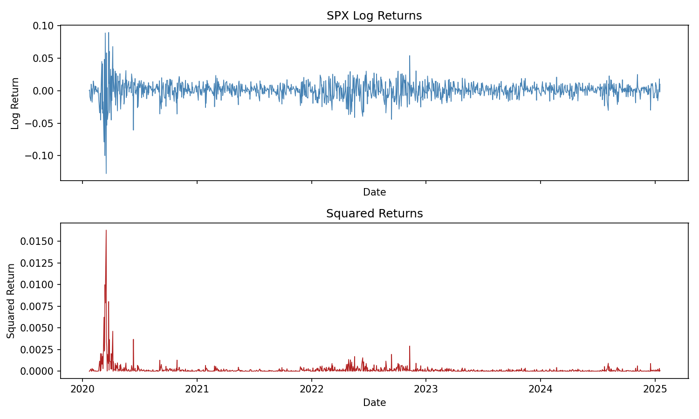 |

- ADF statistics: -15.326080 (1y) vs -10.553191 (5y).
- The longer window spans more regimes, which can show broader clusters in squared returns.
- Use this to compare how dominant the April 2025 shock is relative to the longer history.

### ACF/PACF

| Train 1y | Train 5y |
| --- | --- |
| 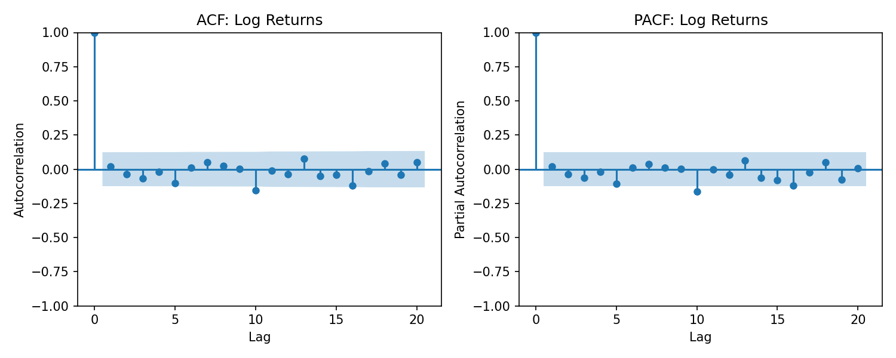 | 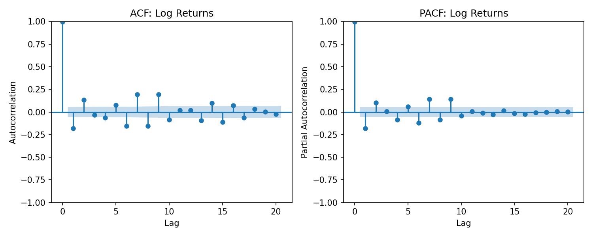 |

- The 5y window selects a higher-order ARMA ((3, 2)), indicating more short-run structure in the longer sample.
- The 1y window selects a simpler ARMA ((0, 1)), reflecting less persistent autocorrelation.
- Compare decay speed and significant lags to see why the order differs.

## Modeling variants

### Best-variant volatility (BIC)

| Train 1y | Train 5y |
| --- | --- |
|  |  |

- Both runs select EGARCH_t by BIC, but the variance level is conditioned on different training histories.
- Look for differences in how quickly conditional volatility decays after spikes.
- The 5y training set can yield smoother variance dynamics due to more history.

### Variant comparison

| Train 1y | Train 5y |
| --- | --- |
|  | 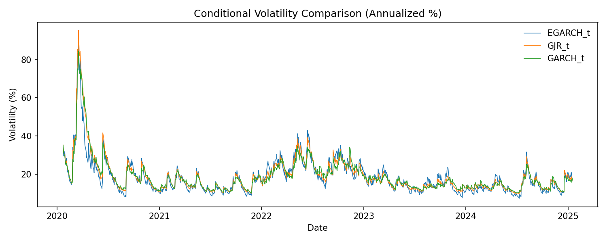 |

- The spread between variants shows how sensitive conditional volatility is to model choice.
- Wider separation indicates higher specification risk; tighter clustering indicates robustness.
- Compare the relative ordering of variants to see if the long sample changes the ranking.

### Variants vs realized

| Train 1y | Train 5y |
| --- | --- |
|  |  |

- The tracking-best variant differs: GARCH (1y) vs GARCH_t (5y).
- The 5y window has higher tracking correlation (0.9552) but higher RMSE, implying stronger co-movement but looser level matching.
- Compare the gap width during April 2025 to see which training length tracks realized volatility better.

### Variant metrics

| Train 1y | Train 5y |
| --- | --- |
|  | 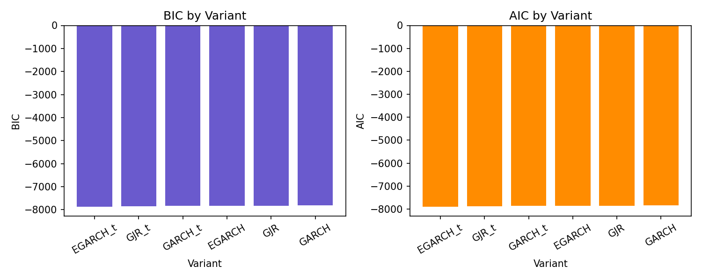 |

- BIC/AIC spacing indicates whether one model clearly dominates or if multiple fits are similar.
- The 5y window typically produces stronger penalties for complexity due to more data.
- Use this to understand the stability of the BIC winner.

### BIC vs tracking

| Train 1y | Train 5y |
| --- | --- |
|  |  |

- Lower-left points are best on both fit and tracking.
- The 5y sample often separates variants more, revealing trade-offs between fit and tracking.
- Compare the position of the tracking-best variant relative to the BIC-best variant.

## Validation

### Residual series

| Train 1y | Train 5y |
| --- | --- |
| 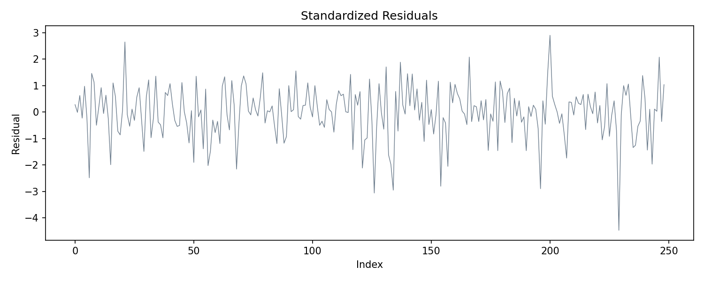 |  |

- Ljung-Box (residuals) p-values: 0.548674 (1y) vs 0.000003 (5y).
- The 5y run shows more residual structure, indicating the longer window may leave more unmodeled dynamics.
- Use this plot to see whether residual clustering remains after GARCH filtering.

### Residual ACF

| Train 1y | Train 5y |
| --- | --- |
|  | 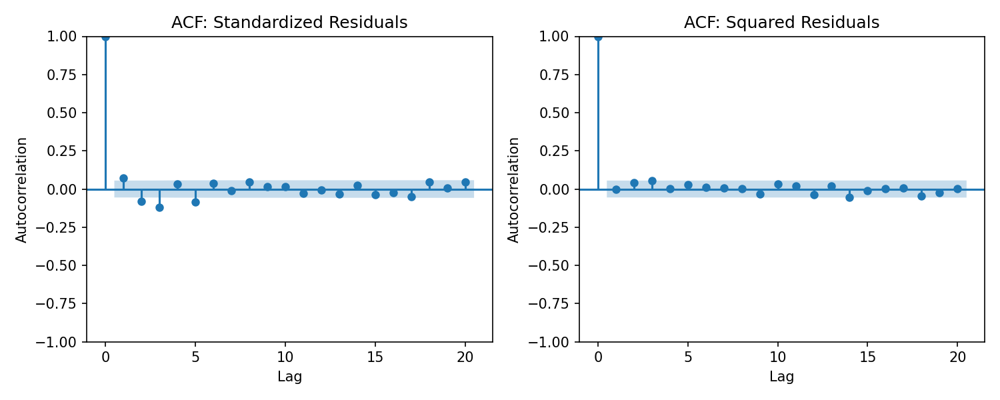 |

- Compare residual and squared-residual autocorrelation levels to see which run leaves more structure.
- The 5y window may retain more low-lag autocorrelation due to longer historical dynamics.
- Flatter lines indicate better model adequacy.

### Residual QQ

| Train 1y | Train 5y |
| --- | --- |
|  | 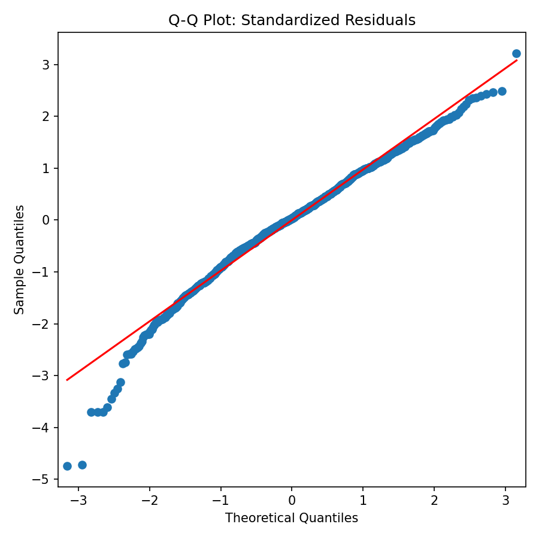 |

- Tighter alignment with the reference line indicates a closer-to-normal residual distribution.
- Deviations in tails indicate fat-tail behavior not fully captured by the model.
- Compare tail curvature to assess distributional fit across windows.

## Out of sample forecasts

### Forecast vs realized (static)

| Train 1y | Train 5y |
| --- | --- |
| 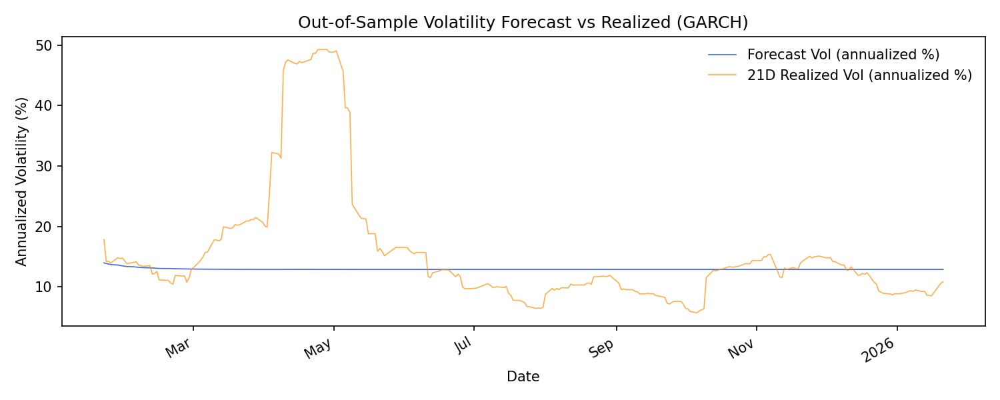 |  |

- Static forecasts are worse in the 5y run (corr -0.2236, rmse 11.4346) compared with the 1y run (corr -0.0334, rmse 10.6947).
- The longer training window can under-react to the April 2025 shock in a static fit.
- Use this to see how much adaptation is needed from rolling updates.

### Forecast vs realized (rolling)

| Train 1y | Train 5y |
| --- | --- |
| 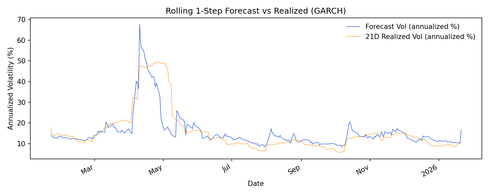 | 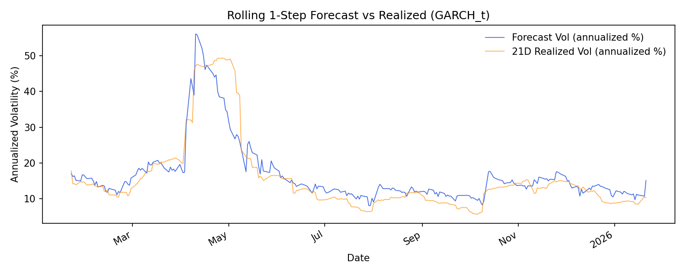 |

- Rolling forecasts improve markedly with 5y training (corr 0.9302, rmse 4.0673) versus 1y (corr 0.8107, rmse 6.0586).
- The 5y model is more stable, giving smoother updates through the shock window.
- Compare how quickly each run reacts to April 10-16 and how fast it mean-reverts after.

## Regime analysis

### Conditional volatility regimes

| Train 1y | Train 5y |
| --- | --- |
| 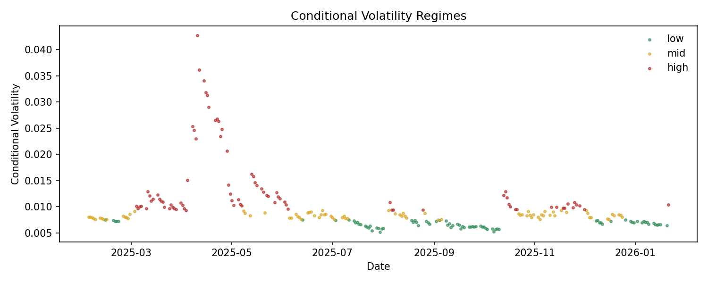 |  |

- Thresholds are slightly higher in the 5y run (low 0.007858, high 0.009745) than the 1y run (low 0.007564, high 0.009332).
- Higher thresholds mean fewer observations are classified as high-vol in the longer window.
- Compare how dense the April cluster is in each run.

### VIX vs realized (10D)

| Train 1y | Train 5y |
| --- | --- |
| 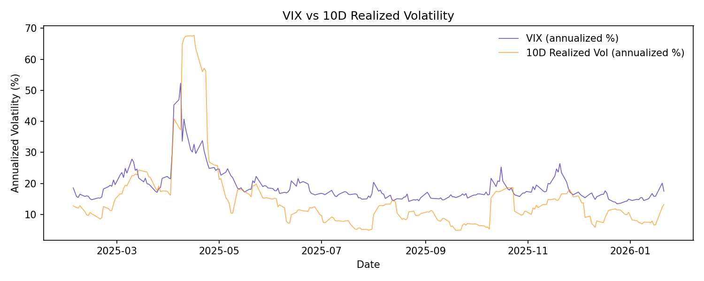 |  |

- Both runs select a 10-day realized window, so differences are driven by conditional volatility and regime thresholds.
- Look for implied-vs-realized gaps around April 2025 and how they resolve after.
- The longer training window can smooth conditional volatility, affecting regime labeling.

### Realized window metrics

| Train 1y | Train 5y |
| --- | --- |
|  | 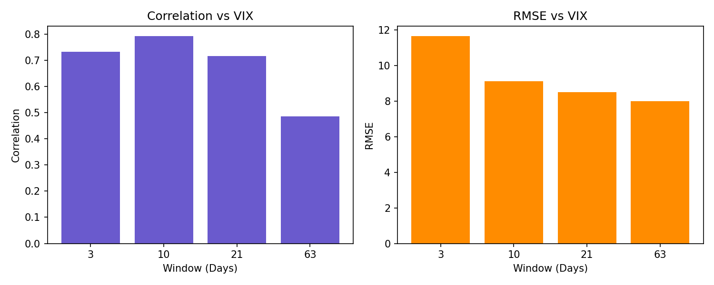 |

- Both select 10 days, but the correlation and RMSE levels can differ by training window.
- Use this to see if the longer window shifts the VIX alignment profile.
- A flatter curve indicates less sensitivity to window choice.

### Regime outcomes

| Train 1y | Train 5y |
| --- | --- |
|  | 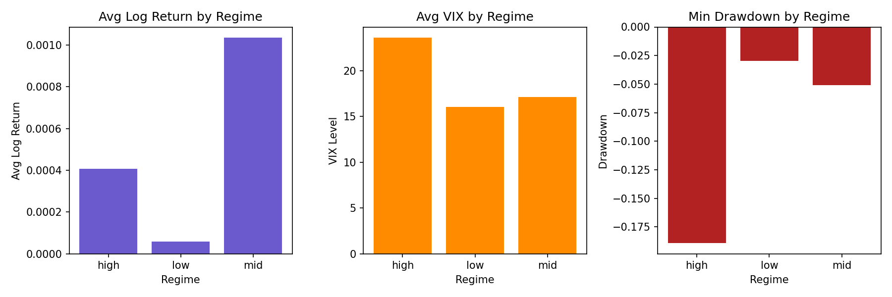 |

- Compare average returns and drawdowns across regimes to see if regime separations change with longer training.
- Stronger separation in the 5y run implies more stable regime ordering.
- Similar bar shapes imply the regime definitions are robust to training length.

## Strategy backtest

### Equity curve (full window)

| Train 1y | Train 5y |
| --- | --- |
| 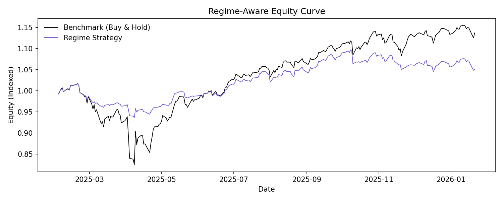 | 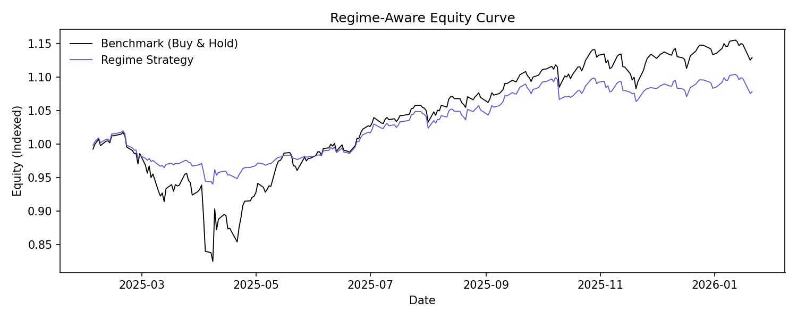 |

- The 5y run shows higher strategy Sharpe (0.8884) versus 1y (0.5568).
- The 5y run also delivers a higher annual return (7.80%) with similar max drawdown.
- Compare relative performance during the April 2025 shock to assess timing differences.

### Equity curve (last year)

| Train 1y | Train 5y |
| --- | --- |
|  | 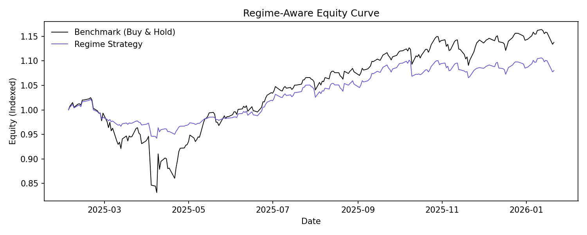 |

- A wider gap in April indicates faster de-risking.
- The 5y run appears smoother due to longer training, while the 1y run can be more reactive.
- Compare how quickly each run recovers after the shock window.

### Exposure overlay (full window)

| Train 1y | Train 5y |
| --- | --- |
|  | 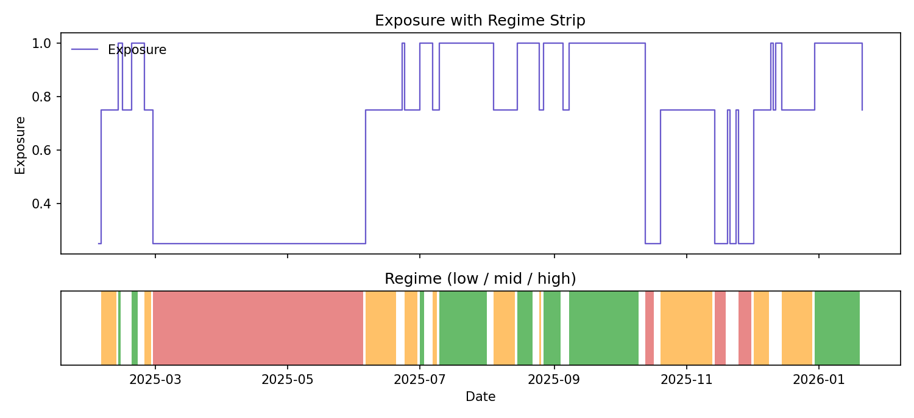 |

- Longer training tends to produce fewer abrupt exposure shifts.
- Faster exposure reductions around April indicate stronger sensitivity to volatility spikes.
- Compare the persistence of low-exposure regimes after the shock.

### Exposure overlay (last year)

| Train 1y | Train 5y |
| --- | --- |
|  |  |

- This zoom highlights differences in exposure timing around April 2025.
- Earlier cuts reduce drawdown risk but can create return drag if the rebound is fast.
- Compare re-risking speed after the April cluster.

## Hedge monitoring

### Hedge ratio

| Train 1y | Train 5y |
| --- | --- |
|  | 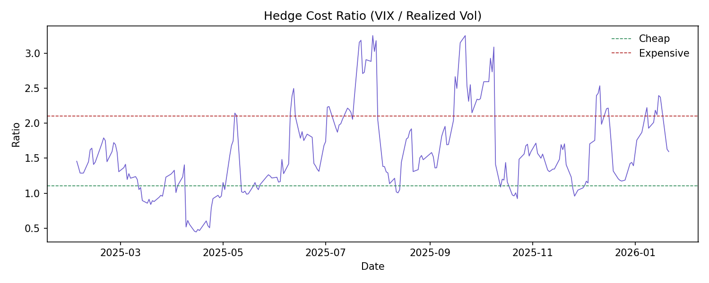 |

- Thresholds are the same in both runs (1.105 / 2.104), so differences come from realized volatility input.
- Compare the duration of expensive-hedge periods during April 2025.
- Longer training can shift the timing of hedge signals rather than the thresholds.

### VIX vs realized (hedge)

| Train 1y | Train 5y |
| --- | --- |
| 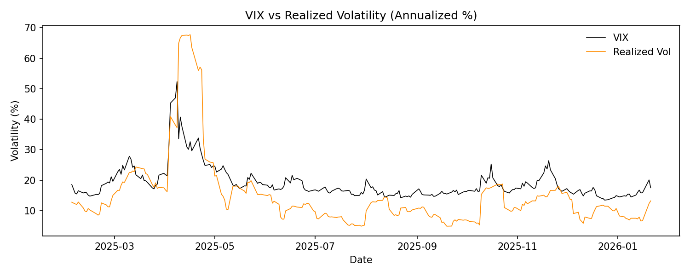 |  |

- Use this to see if implied volatility leads realized moves differently in the longer training window.
- The April gap patterns should be visible in both runs but may differ in magnitude.
- If lines converge faster in one run, it indicates quicker decay of risk premia.
